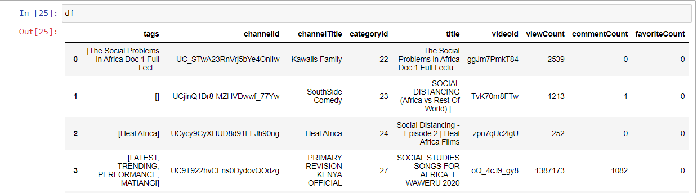

# **YouTube Data Collection**
In this section, we describe how we collected YouTube data related to social concerns in Africa. The process involved using the YouTube Data API for structured data collection and Selenium for web scraping to extract additional details.

## 1. Introduction
We collected YouTube data using two main methods:

YouTube Data API: To fetch metadata such as video statistics, tags, and categories.
Web Scraping (Selenium): To gather video descriptions, titles, and links not available via the API.
2.
## 2. Summary of Collected Data

Below is a sample of the data collected using the YouTube Data API:


## 2. Code for Collecting YouTube Data by API

We used the `youtube_search` function defined in the `youtube_data.py` file to search for videos related to social concerns. The function collects data such as video title, view count, comment count, etc. Here's the code used for this process:

### Importing Necessary Libraries

```python
import pandas as pd
import matplotlib.pyplot as plt
import seaborn as sns
from youtube_data import youtube_search
```

### Defining the `read_youtube` Function

This function takes a list of keywords, a start year, and an end year to search YouTube for videos related to social concerns.

```python
def read_youtube(list_title, start_year, end_year):
    tests = []
    for i in range(start_year, end_year + 1):
        for title in list_title:
            tests.append(youtube_search("social " + title + ", Africa, " + str(i)))
    return tests

test = read_youtube(["concern", "problem", "challenge", "worry", "issue", "question"], 2020, 2020)

df_test = []
for t in test:
    t.keys()
    df_test.append(pd.DataFrame(data=t))

df = pd.concat(df_test)
df.to_excel("concerns120202020.xlsx")
```

### Processing and Saving Data

We processed the data collected and saved it to both Excel and CSV formats for further analysis.

```python
df_test = []
for t in test:
    t.keys()
    df_test.append(pd.DataFrame(data=t))

df = pd.concat(df_test)
df.to_excel("concerns120202020.xlsx")
df.to_csv('concerns20202020.csv', sep=',', index=False)
```

### Code for Scraping YouTube Data Using Selenium

We used Selenium WebDriver to scrape video details such as title and description for each video. The following code demonstrates how we used Selenium to extract this information:

```python
from selenium import webdriver 
import pandas as pd 
from selenium.webdriver.common.by import By 
from selenium.webdriver.chrome.options import Options

driver_path = "chromedriver101.exe"
option = Options()
option.add_argument("--disable-infobars")
option.add_argument("start-maximized")
option.add_argument("--disable-extensions")

driver = webdriver.Chrome(executable_path=driver_path, options=option)

for i in range(1, 2): # Iterate through pages
    driver.get("https://www.youtube.com/results?search_query=social+concerns%2C+Africa%2C+2018")

    user_data = driver.find_elements(By.XPATH, '//*[@id="video-title"]')
    links = []
    for i in user_data:
        links.append(i.get_attribute('href'))

    print(len(links))

    df = pd.DataFrame(columns=['link', 'title', 'description', 'category'])

    for x in links:
        driver.get(x)
        v_id = x.strip('https://www.youtube.com/watch?v=')
        v_title = driver.find_element(By.CSS_SELECTOR, "h3#video-title").text
        v_description = driver.find_element(By.CSS_SELECTOR, "span#description-text").text
        df.loc[len(df)] = [v_id, v_title, v_description, 'concerns']

df.to_excel("youconcerns120182.xlsx")
```

### Saving the Scraped Data

Finally, we save the scraped data into a CSV file:

```python
df.to_csv("youtube_concerns.csv", encoding='utf-8', index=False)
```
