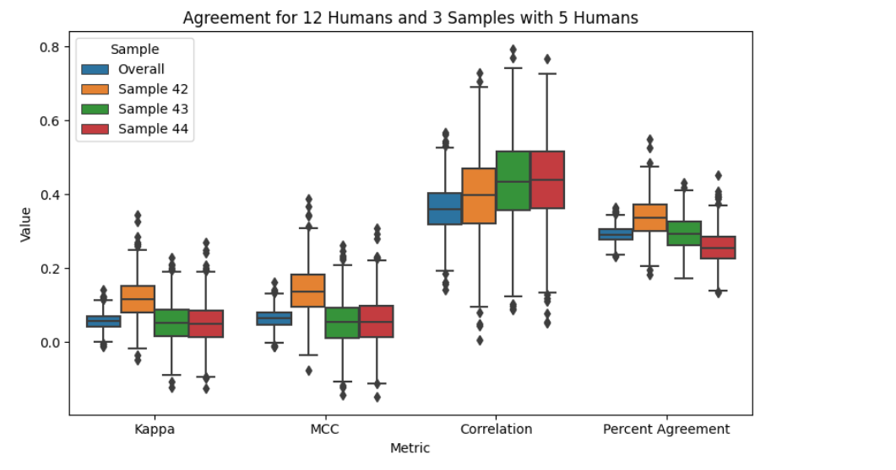
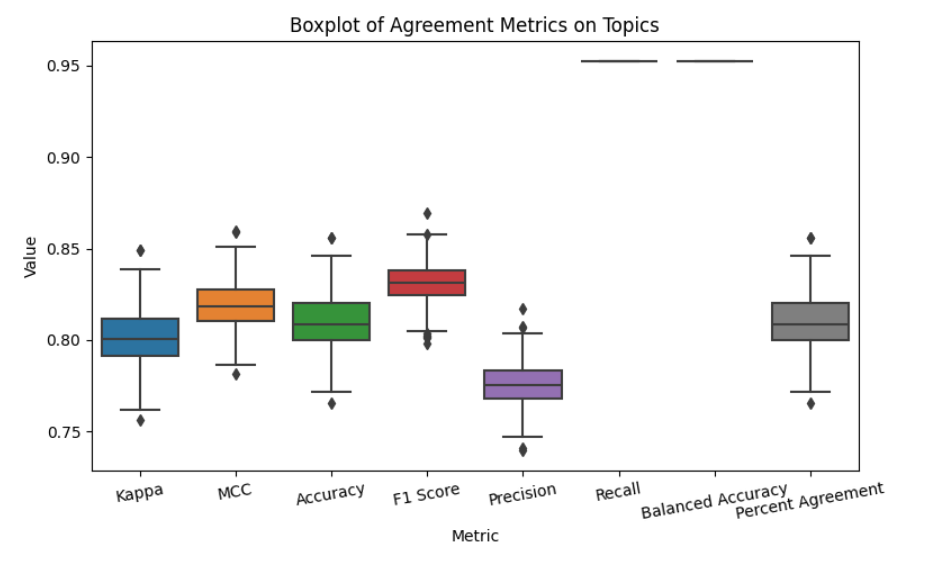
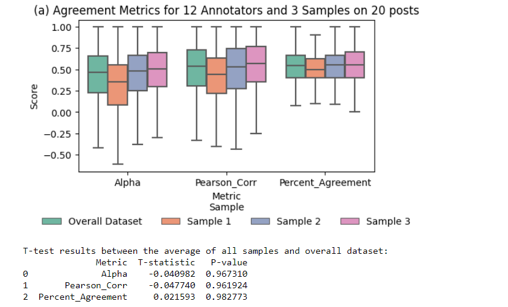
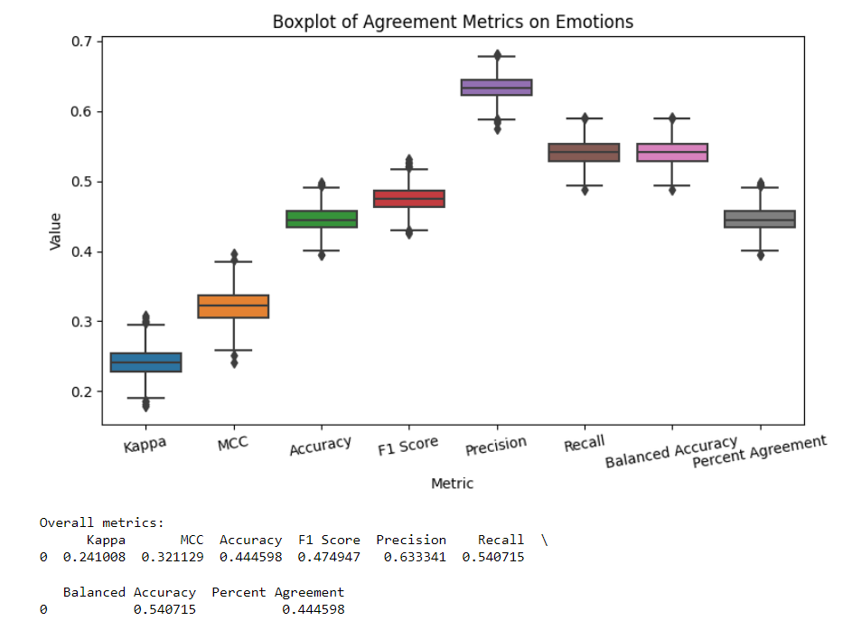
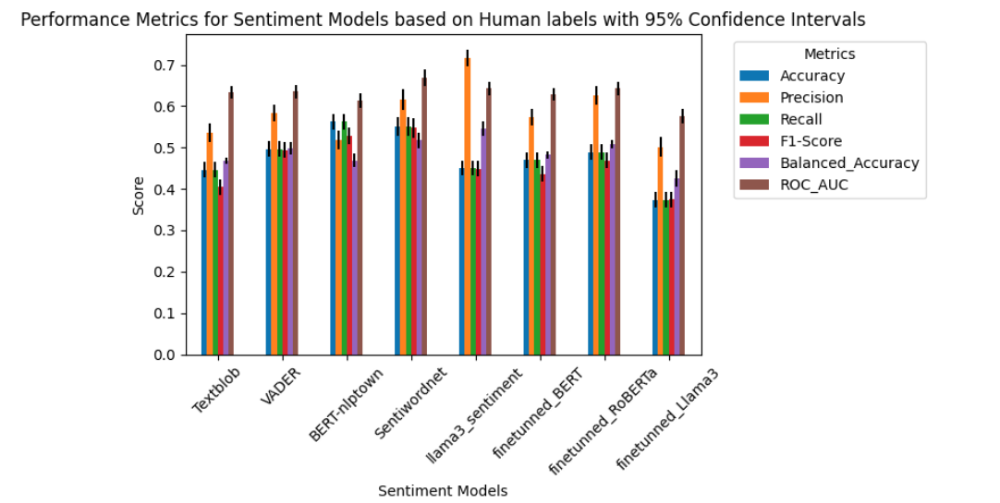
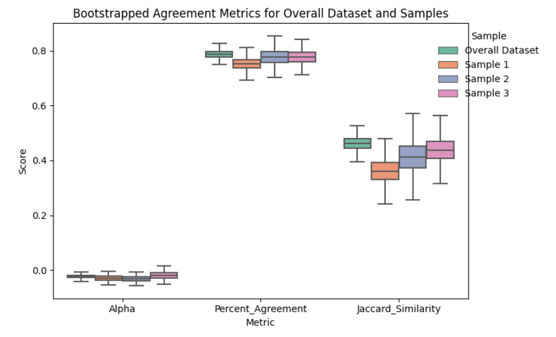
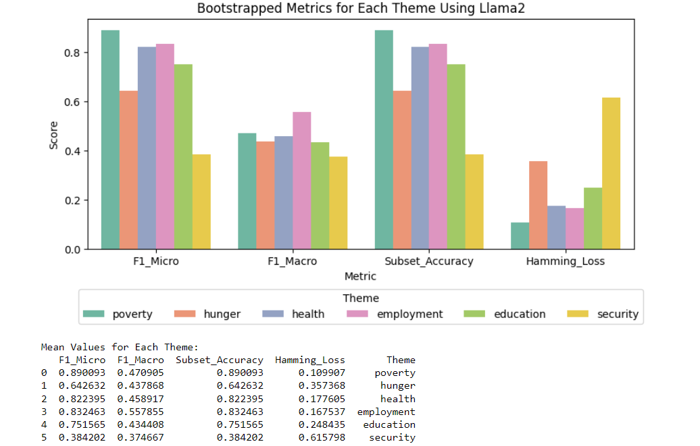

# **Evaluation of Human Labels**

This document outlines the evaluation of human labels in a dataset by starting with bootstrapping on a 12-human dataset and subsequently evaluating the ground truth labels for the overall dataset. The evaluation involves reshaping data, merging labels, generating ground truth labels, calculating evaluation metrics, performing statistical analyses, and visualizing results. Metrics such as Cohen's Kappa, MCC, Pearson Correlation, F1 Score, Precision, Recall, and more are computed to assess agreement.

---

## **1. Reshaping and Filtering Data**

The data is reshaped to combine `Topics`, `Themes`, and `Emotions` into a single DataFrame. Specific topics are filtered for analysis.

### **Code Snippet: Reshaping Data**
```python
# Renaming columns for clarity
columns = df2.columns
new_columns = []
for col in columns:
    if 'To what extent is the topic' in col:
        new_columns.append(f'Topic_{col.split(":")[1].strip()}"')
    elif 'What is the overall mood' in col:
        new_columns.append(f'Emotion')
    elif 'Select all themes' in col:
        new_columns.append(f'Theme')
    else:
        new_columns.append(col)
df2.columns = new_columns

# Combine topics, themes, and emotions
id_vars = ['Timestamp', 'Participant email']
value_vars_topics = [col for col in df2.columns if 'Topic' in col]

combined_data = []
for i, topic_col in enumerate(value_vars_topics):
    combined_df = df2[id_vars + [topic_col]]
    combined_df.columns = id_vars + ['Topic']
    combined_data.append(combined_df)

df_combined = pd.concat(combined_data, ignore_index=True)
```

---
# Analysis on Topics

## **1. Merging and Standardizing Labels**

Human labels and model-generated labels are aligned for comparison. Discrepancies are resolved by standardizing label formats.

### **Code Snippet: Merging Labels**
```python
# Standardize labels
df_combined['Topic'] = df_combined['Topic'].str.strip().str.lower()
df['llama2_labelone'] = df['llama2_labelone'].str.strip().str.lower()

# Merge datasets
merged_df = df.merge(df_combined, left_on='llama2_labelone', right_on='Topic', how='left')

# Handling missing labels
merged_df['Predicted_Labels'] = merged_df['Predicted_Labels'].fillna('unknown')
```

---

## **2. Generating Ground Truth Labels for the Overall Dataset**

After evaluating the 12-human dataset, ground truth labels are generated for the entire dataset based on specific thresholds. This enables the computation of agreement metrics at scale.

### **Code Snippet: Generating Ground Truth Labels**
```python
def generate_ground_truth_labels(df):
    """
    Generate ground truth labels based on a threshold.
    """
    threshold = 2.5
    df['Ground_Truth_Label'] = np.where(df['Average_Topic_Score'] > threshold, df['Topic_Name'], 'no_topic')
    return df

# Ensure numeric values for scores
df['Topic_Score'] = pd.to_numeric(df['Topic_Score'], errors='coerce')
df['Average_Topic_Score'] = df.groupby('textid')['Topic_Score'].transform('mean')

# Generate ground truth labels
df = generate_ground_truth_labels(df)
```
## **2. Bootstrapping on the 12-Human Dataset**

The initial evaluation focuses on a 12-human dataset, where agreement metrics are assessed through bootstrapping to estimate metric distributions.We want to identify the lkeness of random samples for a small group of participants.

### **Code Snippet: Bootstrapping**
```python
def bootstrap_sampling(df, n_iterations=1000, seed=42):
    """
    Perform bootstrap sampling to compute the distribution of agreement metrics
    for the 12-human dataset.
    """
    np.random.seed(seed)
    bootstrap_metrics = []
    
    for _ in range(n_iterations):
        sample = df.sample(n=len(df), replace=True)
        y_true = sample['Ground_Truth_Label_encoded'].values
        y_pred = sample['Topic_Name_encoded'].values
        metrics = calculate_agreement_metrics(y_true, y_pred)
        bootstrap_metrics.append(metrics)
    
    return pd.DataFrame(bootstrap_metrics, columns=[
        'Kappa', 'MCC', 'Accuracy', 'F1 Score', 
        'Precision', 'Recall', 'Balanced Accuracy', 'Percent Agreement'
    ])

# Perform bootstrapping on the 12-human dataset
bootstrap_results = bootstrap_sampling(human_df)

# Save bootstrap results
bootstrap_results.to_csv('bootstrap_metrics_12_human.csv', index=False)
```
Visualize the bootstrap metrics


---

## **3. Evaluation Metrics for the Overall Dataset**

Metrics like Cohen's Kappa, MCC, Accuracy, F1 Score, Precision, Recall, Balanced Accuracy, and Percent Agreement are computed to assess the agreement between ground truth labels and predictions.

### **Code Snippet: Calculating Metrics**
```python
def calculate_agreement_metrics(y_true, y_pred):
    """
    Calculate agreement metrics between ground truth labels and predictions.
    """
    kappa = cohen_kappa_score(y_true, y_pred)
    mcc = matthews_corrcoef(y_true, y_pred)
    accuracy = accuracy_score(y_true, y_pred)
    f1 = f1_score(y_true, y_pred, average='macro', zero_division=0)
    precision = precision_score(y_true, y_pred, average='macro', zero_division=0)
    recall = recall_score(y_true, y_pred, average='macro', zero_division=0)
    balanced_accuracy = balanced_accuracy_score(y_true, y_pred)
    percent_agreement = np.mean(y_true == y_pred)
    return kappa, mcc, accuracy, f1, precision, recall, balanced_accuracy, percent_agreement

# Compute metrics for the overall dataset
y_true = df['Ground_Truth_Label_encoded'].values
y_pred = df['Topic_Name_encoded'].values
results = calculate_agreement_metrics(y_true, y_pred)

# Save and print results
results_df = pd.DataFrame([results], columns=[
    'Kappa', 'MCC', 'Accuracy', 'F1 Score', 
    'Precision', 'Recall', 'Balanced Accuracy', 'Percent Agreement'
])
results_df.to_csv('overall_metrics.csv', index=False)
print("Overall metrics:")
print(results_df)
```

---

## **4. Visualization of Results**

Visualizations are used to compare metrics from the 12-human dataset and the overall dataset.



Got it! Here’s the revised and reorganized structure of your Markdown file with the correct order of evaluating human labels:

---

# Sentiment Analysis Evaluation

This document evaluates sentiment models against human-labeled ground truth (`Final_Emotional_Label`) using various metrics. The analysis involves data preparation, bootstrapping for agreement metrics, model selection, and visualization of results.

---

## 1. Data Preparation

### 1.1 Cleaning and Transforming Labels

1. **Converting Labels to Lowercase**  
   Emotion labels were standardized to lowercase and stripped of unnecessary characters:

   ```python
   df['Emotion_y'] = df['Emotion_y'].str.lower().str.replace('"', '')
   ```

2. **Adjusting Emotions to Three Categories**  
   Emotions were grouped into three main categories: `positive`, `negative`, and `neutral`.

   ```python
   def adjust_emotions(emotion):
       if 'positive' in emotion:
           return 'positive'
       elif 'negative' in emotion:
           return 'negative'
       else:
           return 'neutral'

   df['Emotion_y'] = df['Emotion_y'].apply(adjust_emotions)
   ```

3. **Mapping Emotions to Numerical Scores**  
   Numerical mappings were used for easier computation:  
   `positive = 1`, `negative = -1`, `neutral = 0`.

   ```python
   emotion_mapping = {'neutral': 0, 'positive': 1, 'negative': -1}
   df['Emotion_Score'] = df['Emotion_y'].map(emotion_mapping)
   ```

---

## 2. Evaluating Human Labels

### 2.1 Bootstrapping Agreement Metrics on the 12-Human Dataset

Agreement across human annotations was evaluated using bootstrapping. Subsets were created from the 12 participants with seeds `[42, 43, 44]`, and bootstrapping was performed with 1000 iterations:

```python
# Create samples and perform bootstrap sampling
samples = create_samples(df, seeds=[42, 43, 44])
bootstrap_results_12_humans = bootstrap_sampling_with_replacement(df)
```



---

### 2.2 Bootstrapping on the Overall Dataset

To assess agreement on the full dataset, bootstrapping was conducted across all data points. Metrics such as Cohen’s Kappa, MCC, accuracy, and others were computed:

```python
from sklearn.metrics import (
    cohen_kappa_score, matthews_corrcoef, accuracy_score,
    precision_score, recall_score, f1_score, balanced_accuracy_score
)

# Calculate agreement metrics
def calculate_agreement_metrics(y_true, y_pred):
    kappa = cohen_kappa_score(y_true, y_pred)
    mcc = matthews_corrcoef(y_true, y_pred)
    accuracy = accuracy_score(y_true, y_pred)
    f1 = f1_score(y_true, y_pred, average='macro', zero_division=0)
    precision = precision_score(y_true, y_pred, average='macro', zero_division=0)
    recall = recall_score(y_true, y_pred, average='macro', zero_division=0)
    balanced_accuracy = balanced_accuracy_score(y_true, y_pred)
    percent_agreement = np.mean(y_true == y_pred)
    return kappa, mcc, accuracy, f1, precision, recall, balanced_accuracy, percent_agreement
```

Bootstrapping was applied to estimate variability in metrics:

```python
def bootstrap_sampling(df, n_iterations=1000, seed=42):
    np.random.seed(seed)
    bootstrap_metrics = []
    
    for _ in range(n_iterations):
        sample = df.sample(n=len(df), replace=True)
        y_true = sample['Mode_Score_encoded']
        y_pred = sample['llama3_sentiment_encoded']
        metrics = calculate_agreement_metrics(y_true, y_pred)
        bootstrap_metrics.append(metrics)
    
    columns = ['Kappa', 'MCC', 'Accuracy', 'F1 Score', 'Precision', 'Recall', 'Balanced Accuracy', 'Percent Agreement']
    return pd.DataFrame(bootstrap_metrics, columns=columns)

bootstrap_results_overall = bootstrap_sampling(df)
```



---

## 3. Selecting the Best Sentiment Model

To select the best sentiment model, we evaluated performance metrics such as accuracy, F1-Score, and ROC AUC.

### 3.1 Metrics Used for Evaluation

The following metrics were used:

1. **Accuracy**  
   Fraction of correct predictions.
2. **Precision**  
   Ratio of correctly predicted positive observations to total predicted positive observations.
3. **Recall**  
   Ratio of correctly predicted positive observations to all actual positives.
4. **F1-Score**  
   Harmonic mean of precision and recall.
5. **Balanced Accuracy**  
   Average of recall for each class.
6. **ROC AUC**  
   Area under the ROC curve for multi-class settings.

### 3.2 Simulating Probabilities for ROC AUC

For models lacking probability outputs, probabilities were simulated:

```python
def simulate_probabilities(y_pred, classes):
    n_classes = len(classes)
    prob_matrix = np.zeros((len(y_pred), n_classes))
    for i, label in enumerate(classes):
        prob_matrix[:, i] = (y_pred == label).astype(int)
    prob_matrix += np.random.rand(*prob_matrix.shape) * 0.01  # Add small noise
    prob_matrix /= prob_matrix.sum(axis=1, keepdims=True)  # Normalize
    return prob_matrix
```

### 3.3 Bootstrapping for Metric Variability

Bootstrapping was applied to assess the variability of metrics over 1000 iterations:

```python
def bootstrap_metrics(y_true, y_pred, y_score, n_iterations=1000):
    metrics = []
    for _ in range(n_iterations):
        y_true_resampled, y_pred_resampled, y_score_resampled = resample(y_true, y_pred, y_score)
        metrics.append(calculate_metrics(y_true_resampled, y_pred_resampled, y_score_resampled))
    metrics = np.array(metrics)
    means = np.mean(metrics, axis=0)
    std_devs = np.std(metrics, axis=0)
    return means, std_devs
```

---

## 4. Results and Insights

### 4.1 Metrics Summary

The table below summarizes the metrics for all evaluated models:

```python
metrics_df = pd.DataFrame({
    'Model': models,
    'Accuracy': accuracies,
    'Precision': precisions,
    'Recall': recalls,
    'F1-Score': f1_scores,
    'Balanced_Accuracy': balanced_accuracies,
    'ROC_AUC': roc_aucs,
    'Std_Accuracy': std_accuracies,
    'Std_Precision': std_precisions,
    'Std_Recall': std_recalls,
    'Std_F1-Score': std_f1_scores,
    'Std_Balanced_Accuracy': std_balanced_accuracies,
    'Std_ROC_AUC': std_roc_aucs
})

print(metrics_df)
```

### 4.2 Visualization

The performance of sentiment models was visualized using a bar chart with error bars representing 95% confidence intervals:



---

## 5. Key Insights

1. **Top Performers**  
   - `finetuned_RoBERTa` achieved the highest balanced accuracy.  
   - `Llama3_sentiment` had the best F1-scores and ROC AUC.

2. **Consistency**  
   - Models like `BERT-nlptown` showed strong performance but lacked consistency across all metrics.

3. **Impact of Text-based Prompts**  
   - Text-based LLMs like `Llama3_sentiment` produced scores closely aligned with human annotations. Fine-tuning these models on larger datasets can further improve performance.

Here’s a clean and structured Markdown file summarizing your theme analysis for human-labeled data, including the methods, calculations, and visualizations:

---

# Theme Analysis of Human-Labeled Data

This document details the evaluation of themes labeled by humans and their alignment with predicted categories using various agreement metrics. Bootstrapping was used to assess metric variability and provide robust performance estimates.
Themes are extracted, validated, and aggregated across participants to derive a final, consolidated label for each topic.

---

## Preprocessing

### Cleaning and Mapping Themes
- The `Theme` column is preprocessed to ensure uniformity:
  - Quotes are removed.
  - All entries are converted to lowercase for consistency.
  
```python
# Clean the 'Theme' column: remove quotes and convert to lowercase
df['Theme'] = df['Theme'].str.replace('"', '').str.lower()
```

### Theme Mapping
- A numerical mapping is applied to standardize themes:
  - **Mapping**:
    - `others`: 0
    - `poverty`: 1
    - `hunger`: 2
    - `health`: 3
    - `employment`: 4
    - `education`: 5
    - `security`: 6
  - A reverse mapping is created to translate numerical labels back into human-readable themes.
  
```python
# Define the numerical mapping for themes
theme_mapping = {
    'others': 0,
    'poverty': 1,
    'hunger': 2,
    'health': 3,
    'employment': 4,
    'education': 5,
    'security': 6
}

# Reverse mapping for themes
reverse_theme_mapping = {v: k for k, v in theme_mapping.items()}

# Map 'Theme' to 'Theme_Mapped'
df['Theme_Mapped'] = df['Theme'].apply(lambda x: ','.join([str(theme_mapping.get(theme.strip(), '0')) for theme in x.split(',')]))
```

---

## Participant Sampling

### Selecting Participant Data
To ensure robust evaluations, participant data is sampled based on topics. This allows for a diverse representation while maintaining a consistent number of evaluations per topic.

```python
def sample_data(df, seed):
    return df.groupby('Topic_Name').apply(lambda x: x.sample(n=5, random_state=seed, replace=True)).reset_index(drop=True)
```

---

## Computing Final Labels

### Aggregating Themes
Themes for each topic are aggregated across participants to determine the most common themes. A threshold is used to identify themes that have at least half the participants' agreement.

```python
def compute_final_labels(df):
    # Group by 'Topic_Name' and aggregate to find the most common theme across all participants
    topic_common_themes = df.groupby('Topic_Name')['Theme_Mapped'].apply(lambda x: ','.join(x)).reset_index()
    
    # Calculate number of participants per topic
    topic_participant_count = df.groupby('Topic_Name')['Participant email'].nunique().reset_index()
    topic_participant_count.rename(columns={'Participant email': 'Participant_Count'}, inplace=True)

    # Merge participant count into topic_common_themes
    topic_common_themes = pd.merge(topic_common_themes, topic_participant_count, on='Topic_Name', how='left')

    # Compute final multilabel based on threshold
    def calculate_final_label(row):
        themes = pd.Series(row['Theme_Mapped'].split(','))
        theme_counts = themes.value_counts()
        half_participants = row['Participant_Count'] / 2
        common_themes = theme_counts[theme_counts >= half_participants].index
        if len(common_themes) == 0:
            return '0'  # Indicate 'Others' if no common theme by half the participants
        return ','.join(common_themes)

    topic_common_themes['Final_Label'] = topic_common_themes.apply(calculate_final_label, axis=1)

    # Merge back the final labels into the original DataFrame
    df = pd.merge(df, topic_common_themes[['Topic_Name', 'Final_Label']], on='Topic_Name', how='left')

    # Map final labels back to theme names
    df['Final_Label_Themes'] = df['Final_Label'].apply(lambda x: ','.join([reverse_theme_mapping.get(int(val), 'Unknown') for val in x.split(',')]))

    return df
```

## Human Evaluations of Sample Datasets and Overall Dataset

We compute agreement metrics to assess theme labeling consistency across participants, using bootstrapping to estimate reliability and variability. Metrics include Krippendorff's Alpha, Percent Agreement, and Jaccard Similarity.

### Step 1: Compute Agreement Metrics

The `compute_agreement_metrics` function calculates metrics for pairs of participants using binarized theme labels and computes pairwise comparisons.

```python
def compute_agreement_metrics(df):
    participants = df['Participant email'].unique()
    metrics = {'Alpha': [], 'Percent_Agreement': [], 'Jaccard_Similarity': []}

    # Theme mapping and binarization
    theme_mapping = {'others': 0, 'poverty': 1, 'hunger': 2, 'health': 3, 'employment': 4, 'education': 5, 'security': 6}
    df['Theme_Mapped'] = df['Theme'].apply(lambda x: [theme_mapping.get(theme.strip(), 0) for theme in x.split(',')])
    mlb = MultiLabelBinarizer(classes=list(theme_mapping.values()))
    df['Theme_Binarized'] = df['Theme_Mapped'].apply(lambda x: mlb.fit_transform([x])[0])

    # Pairwise comparison
    for i in range(len(participants)):
        for j in range(i + 1, len(participants)):
            # Process pair of participants and calculate metrics...
            # Append Krippendorff's alpha, percent agreement, and Jaccard similarity to metrics
    return metrics
```

---

### Step 2: Bootstrap Sampling

Bootstrap sampling with replacement allows us to estimate the metrics' variability by resampling the data.

```python
def bootstrap_sampling_with_replacement(df, n_iterations=1000):
    bootstrap_metrics = {'Alpha': [], 'Percent_Agreement': [], 'Jaccard_Similarity': []}
    for _ in range(n_iterations):
        bootstrap_sample = df.sample(n=len(df), replace=True)
        metrics = compute_agreement_metrics(bootstrap_sample)
        # Append bootstrap sample metrics
    return pd.DataFrame(bootstrap_metrics)
```

---

### Step 3: Generate Samples

Generate multiple samples with different seeds to evaluate the agreement on independent subsets of participants.

```python
def create_samples(df, seeds, n_participants=5):
    samples = []
    for seed in seeds:
        np.random.seed(seed)
        sample_participants = np.random.choice(df['Participant email'].unique(), size=n_participants, replace=False)
        sample_df = df[df['Participant email'].isin(sample_participants)]
        samples.append(sample_df)
    return samples
```

---

### Visualization

We generate samples, compute metrics for each, and combine them for plotting. 

```python
# Generate samples and calculate metrics
samples = create_samples(df, seeds)
all_sample_results = [bootstrap_sampling_with_replacement(sample_df) for sample_df in samples]
bootstrap_results_overall = bootstrap_sampling_with_replacement(df)

# Combine results and plot
all_bootstrap_results_melted = pd.concat([bootstrap_results_overall.assign(Sample='Overall Dataset')] +
                                          [result.assign(Sample=f'Sample {i+1}') for i, result in enumerate(all_sample_results)])
all_bootstrap_results_melted = all_bootstrap_results_melted.melt(id_vars=['Sample'], var_name='Metric', value_name='Value')
```
A boxplot visualizes the variability of agreement metrics.



## Model Evaluation (Llama vs Human Labels)

We evaluate the performance of the Llama model by comparing its predictions (`Predicted_Categories3`) against human-assigned labels (`Theme`) using several metrics: F1 score (micro and macro), subset accuracy, and hamming loss. The evaluation is done per theme and employs bootstrap sampling to estimate the variability of the metrics.

### Evaluation Metrics
1. **F1 Micro**: Measures overall performance across all themes.
2. **F1 Macro**: Calculates the F1 score per theme and averages it.
3. **Subset Accuracy**: Measures the percentage of exact matches between the human and model labels for each theme.
4. **Hamming Loss**: Measures the proportion of incorrectly predicted labels.

### Steps for Evaluation

1. **Clean and map the labels**:
    - Both human labels (`Theme`) and model predictions (`Predicted_Categories3`) are cleaned and mapped to numerical values using a predefined theme mapping.
  
```python
theme_mapping = {
    'poverty': 1, 'hunger': 2, 'health': 3, 'employment': 4, 
    'education': 5, 'security': 6, 'others': 0
}

# Clean and map labels
df['Theme'] = df['Theme'].str.replace('"', '').str.lower()
df['Predicted_Categories3'] = df['Predicted_Categories3'].str.replace('"', '').str.lower()
df['Theme_Mapped'] = df['Theme'].apply(lambda x: [theme_mapping.get(theme.strip(), 0) for theme in x.split(',')])
df['Predicted_Mapped'] = df['Predicted_Categories3'].apply(lambda x: [theme_mapping.get(theme.strip(), 0) for theme in x.split(',')])

# Binarize the labels
mlb = MultiLabelBinarizer(classes=list(theme_mapping.values()))
theme_binarized = mlb.fit_transform(df['Theme_Mapped'])
predicted_binarized = mlb.transform(df['Predicted_Mapped'])

df['Theme_Binarized'] = list(theme_binarized)
df['Predicted_Binarized'] = list(predicted_binarized)
```

2. **Compute Agreement Metrics**:
    - We calculate F1 scores, subset accuracy, and Hamming loss for each theme by comparing human labels and Llama predictions.

```python
def compute_agreement_metrics_for_theme(themes1, themes2):
    metrics = {
        'F1_Micro': f1_score(themes1, themes2, average='micro', zero_division=0),
        'F1_Macro': f1_score(themes1, themes2, average='macro', zero_division=0),
        'Subset_Accuracy': np.mean(np.all(themes1 == themes2, axis=1)) if themes1.ndim == 2 else np.mean(themes1 == themes2),
        'Hamming_Loss': hamming_loss(themes1, themes2)
    }
    return metrics
```

3. **Bootstrap Sampling**:
    - We perform bootstrap sampling with replacement for each theme to estimate the distribution of the metrics and their variability.

```python
def bootstrap_sampling_for_theme(df, theme_index, n_iterations=1000, seed=42):
    np.random.seed(seed)
    bootstrap_metrics = {'F1_Micro': [], 'F1_Macro': [], 'Subset_Accuracy': [], 'Hamming_Loss': []}

    themes1_all = np.vstack(df['Theme_Binarized'].tolist())
    themes2_all = np.vstack(df['Predicted_Binarized'].tolist())

    theme1 = themes1_all[:, theme_index]
    theme2 = themes2_all[:, theme_index]

    for _ in range(n_iterations):
        bootstrap_indices = np.random.choice(range(len(df)), size=len(df), replace=True)
        themes1_sample = theme1[bootstrap_indices]
        themes2_sample = theme2[bootstrap_indices]

        metrics = compute_agreement_metrics_for_theme(themes1_sample, themes2_sample)
        for metric in bootstrap_metrics:
            bootstrap_metrics[metric].append(metrics[metric])

    return pd.DataFrame(bootstrap_metrics)
```

4. **Visualize Results**:
    - The results for each theme are visualized using a bar plot showing the bootstrapped metrics.

```python
# Perform bootstrap sampling for each theme (excluding 'others')
all_metrics = []
for theme, index in theme_mapping.items():
    if theme != 'others':
        bootstrap_results = bootstrap_sampling_for_theme(df, index)
        mean_values = bootstrap_results.mean().to_frame().T
        mean_values['Theme'] = theme
        all_metrics.append(mean_values)

# Combine results for plotting
all_metrics_df = pd.concat(all_metrics, ignore_index=True)
all_metrics_melted = all_metrics_df.melt(id_vars='Theme', var_name='Metric', value_name='Value')
```

- The bootstrapped metrics for each theme are shown in a bar plot, and the values of each metric are based on existance each label in the mulitilabel column.
  
