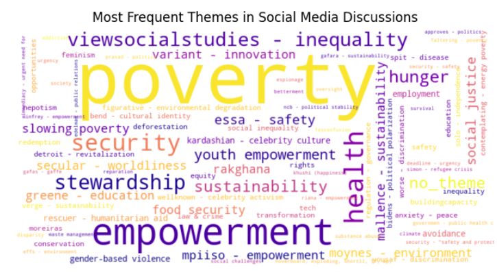
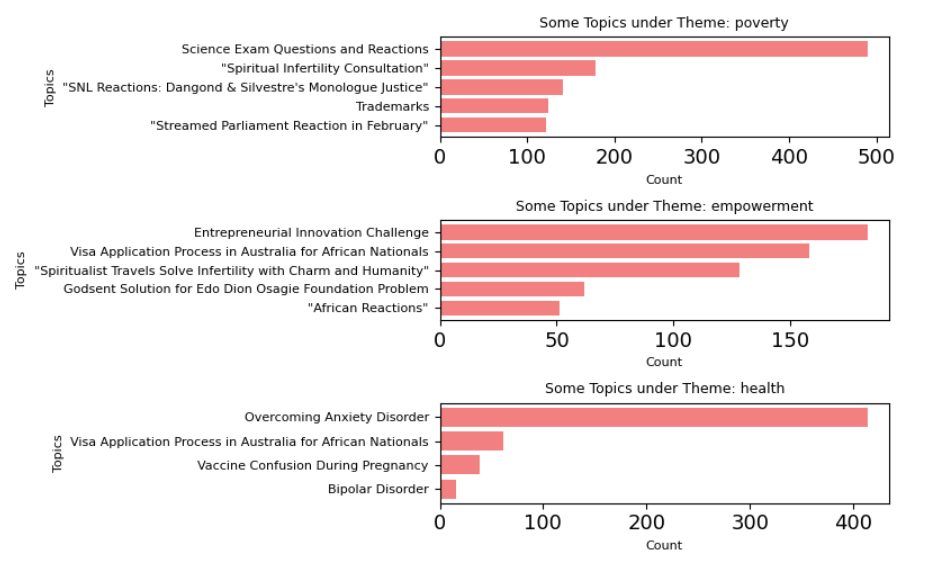
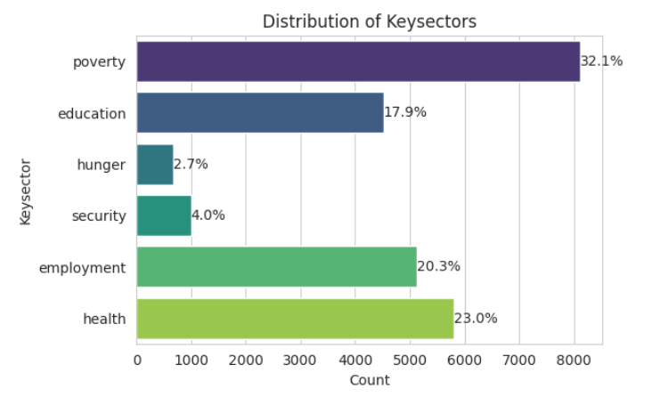
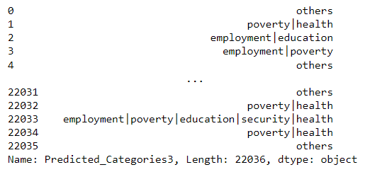

# **Theme Extraction Based on Topics**

This document outlines the process of extracting themes and labels from a dataset of documents using machine learning techniques, natural language processing (NLP), and language models.

## Import Libraries
```python
import numpy as np
import pandas as pd

import tensorflow as tf
from tensorflow.keras.preprocessing.text import Tokenizer
from tensorflow.keras.preprocessing.sequence import pad_sequences
from tensorflow.keras import Sequential
from tensorflow.keras.layers import Dense, Dropout, Embedding, Conv1D, LSTM, GlobalMaxPooling1D
from tensorflow.keras.callbacks import EarlyStopping

from sklearn.metrics import classification_report
from sklearn.feature_extraction.text import TfidfVectorizer
from sklearn.model_selection import train_test_split

from nltk.stem import PorterStemmer
from nltk.corpus import stopwords
import nltk
nltk.download('stopwords')

import matplotlib.pyplot as plt
import seaborn as sns
```

## Data Loading and Preprocessing
```python
# Load dataset
df = pd.read_csv('BERT-CTFIDF.csv')
df = df.astype(str)
```

### Text Cleaning
1. **Stopwords Removal**: Custom stopwords based on frequency.
2. **Tokenization**: Splitting documents into tokens.
3. **Vocabulary Construction**: Identify most common words.

## Embedding Generation
Using Sentence-Transformers:
```python
from sentence_transformers import SentenceTransformer
import umap

MODEL_NAME = 'sentence-transformers/paraphrase-MiniLM-L6-v2'
embedding_model = SentenceTransformer(MODEL_NAME)
documents = df['Text_lemma'].values

# Generate embeddings
embeddings = embedding_model.encode(documents, convert_to_tensor=True)
X_embedded = umap.UMAP(n_neighbors=15, n_components=5, metric='cosine').fit_transform(embeddings.cpu().numpy())
```

## Clustering
Using HDBSCAN:
```python
import hdbscan
from sklearn.metrics import silhouette_score

cluster = hdbscan.HDBSCAN(min_cluster_size=15, metric='euclidean').fit(X_embedded)
silhouette = silhouette_score(X_embedded, cluster.labels_)
df['cluster_id'] = cluster.labels_
```

## Extracting Top Words per Cluster
Using TF-IDF:
```python
def c_tf_idf(documents, m):
    count = TfidfVectorizer(stop_words='english').fit(documents)
    t = count.transform(documents).toarray()
    tf_idf = t.T / t.sum(axis=1)
    return tf_idf, count

tf_idf, count = c_tf_idf(df['Text_lemma'].values, len(df))
```

## Labeling with Large Language Models
Using Llama:
```python
from transformers import AutoTokenizer, AutoModelForCausalLM, pipeline

model_id = 'meta-llama/Llama-2-7b-chat-hf'
tokenizer = AutoTokenizer.from_pretrained(model_id)
model = AutoModelForCausalLM.from_pretrained(model_id)
generator = pipeline('text-generation', model=model, tokenizer=tokenizer)

# Generate labels
def generate_labels(prompt, top_words):
    labels = []
    for topic, words in top_words.items():
        keywords = ', '.join([w[0] for w in words])
        full_prompt = prompt.replace("[KEYWORDS]", keywords)
        labels.append(generator(full_prompt)[0]['generated_text'])
    return labels
```

## Flexible Theme Generation
```python
def generate_themes(top_words, generator):
    themes = []
    for _, words in top_words.items():
        keywords = ', '.join([w[0] for w in words])
        theme_prompt = f"Based on the following keywords: {keywords}, suggest a single-word theme."
        themes.append(generator(theme_prompt)[0]['generated_text'])
    return themes
```

## Output Results
```python
df.to_csv('BERT_CTFIDFwsp2_themes2.csv', index=False)
```

Here’s the continuation of the documentation in `.md` format based on your new code sections:

```markdown
## Theme Cleaning and Standardization
To ensure consistency in themes, a cleaning function is applied to the `theme` column.

### Cleaning Function
The cleaning process includes:
1. Converting text to lowercase.
2. Removing numerical prefixes and redundant answer indications.
3. Prioritizing text after a colon (if present).
4. Truncating descriptions longer than 5 words.
5. Removing unwanted phrases and assigning `no_theme` for unclear themes.

```python
import re

def clean_theme(theme):
    theme = theme.lower()
    theme = re.sub(r'^\d+\.\s*|^answer:\s*|^\*', '', theme)
    if ':' in theme:
        theme = theme.split(':', 1)[1]
    if theme.count('-') > 1:
        theme = re.sub(r'-(.*)$', '', theme)
    theme = ' '.join(theme.split()[:5])
    theme = theme.strip()
    if any(phrase in theme for phrase in ['i hope this helps', 'please let me know if', 'hundredpoints']):
        return 'no_theme'
    return theme

df['cleaned_theme'] = df['theme'].apply(clean_theme)
```

### Unique Themes and Distribution
- **Initial Unique Themes:** Counted from the `initial_label` column.
- **Llama2 Labels Unique Themes:** Counted from the `llama2_labelone` column.
- **Cleaned Themes:** Display the unique themes after applying the cleaning function.

```python
unique_cleaned_themes = df['cleaned_theme'].unique()
print(f"Number of Cleaned Themes: {len(unique_cleaned_themes)}")
```

---

## Coherence Scores
To evaluate the quality of themes, coherence scores are calculated using Gensim's `CoherenceModel` with different metrics:

1. **C_v (Topic Coherence)**
2. **NPMI (Normalized Pointwise Mutual Information)**
3. **U_mass**

```python
from gensim.models.coherencemodel import CoherenceModel
from gensim.corpora.dictionary import Dictionary

# Prepare documents and topics
documents = [doc.split() for doc in df['Text_lemma'].tolist()]
dictionary = Dictionary(documents)
topics_list = df['cleaned_theme'].tolist()

# Compute Coherence Scores
coherence_cv = CoherenceModel(topics=topics_list, texts=documents, dictionary=dictionary, coherence='c_v').get_coherence()
coherence_npmi = CoherenceModel(topics=topics_list, texts=documents, dictionary=dictionary, coherence='c_npmi').get_coherence()
coherence_umass = CoherenceModel(topics=topics_list, texts=documents, dictionary=dictionary, coherence='u_mass').get_coherence()

print(f"Coherence (C_v): {coherence_cv}")
print(f"Coherence (NPMI): {coherence_npmi}")
print(f"Coherence (U_mass): {coherence_umass}")
```

---

## IRBO Coherence Score
Using Inverted Rank-Biased Overlap (IRBO), a metric for evaluating overlapping themes:

```python
from contextualized_topic_models.evaluation.measures import InvertedRBO

irbo = InvertedRBO(topics=topics_list)
coherence_irbo = irbo.score(topk=1)
print(f"Coherence Score (IRBO): {coherence_irbo}")
```

---

## Visualizing Themes
### Word Cloud of Most Frequent Themes
A compact word cloud is generated to visualize the most frequent themes.



### Topic Distribution by Top Themes
Bar charts visualize the distribution of topics within the top 3 themes.




**Purpose:** Show the balance between precision and recall, especially useful for imbalanced datasets.

### **Coherence Scores for Topics**
#### Code Snippet:
```python
from gensim.models.coherencemodel import CoherenceModel
from gensim.corpora.dictionary import Dictionary

# Convert 'label_llama2' column to a list
topics_list = df['cleaned_theme'].tolist()

# Convert documents to a list of tokenized documents
documents = df['Text_lemma'].tolist()
documents = [doc.split() for doc in documents]

# Convert documents to a Gensim dictionary
dictionary = Dictionary(documents)

# Compute coherence score using CoherenceModel (C_v)
coherence_model_cv = CoherenceModel(topics=topics_list, texts=documents, dictionary=dictionary, coherence='c_v')
coherence_cv_score = coherence_model_cv.get_coherence()
```
**Purpose:** Compute coherence scores for the topics using different coherence methods (e.g., `c_v`, `npmi`, `u_mass`) to assess the quality of the topics generated in the model.

---
# **Theme extraction by Document similarity**
Here’s the content `.md` file summarizing the process and methodology for **Theme Extraction by Document Similarity**. This is structured to describe the objective, process, and results clearly for six sample themes: *employment*, *poverty*, *hunger*, *education*, *security*, and *health*.

---

## Theme Extraction by Document Similarity

### Objective
The goal is to extract and classify themes from a dataset of text documents using **document similarity techniques** and **machine learning models**. Six key themes—**employment**, **poverty**, **hunger**, **education**, **security**, and **health**—are identified as relevant for sustainable development goals. The approach includes leveraging advanced language models (e.g., Llama 2) and embedding techniques to ensure accurate classification.

---

### Process Overview

#### **Data Loading**
The input dataset (`testdataset_with_predictionstheme.csv`) was loaded and inspected:
```python
new_df = pd.read_csv('/home/hsibitenda/scratch/harriet/llms/testdataset_with_predictionstheme.csv')
```

#### **Tokenization and Embeddings**
- Text documents were tokenized using `AutoTokenizer` and transformed into embeddings using `SentenceTransformer` with the `BAAI/bge-small-en` model.
- Embeddings were precomputed for faster similarity comparisons.

#### **Theme Extraction from Sentence**
A custom classification pipeline was built using the `Llama 2` model to classify text into predefined themes:
1. **Categories**: *employment*, *poverty*, *hunger*, *education*, *security*, and *health*.
2. **Prompt-Based Evaluation**: A natural language prompt guides the classification:
    - *"You are an expert in social analysis classification that impacts sustainable development. Label the text with categories where the probability is 80% or higher."*
3. **Generation Configurations**: The model was fine-tuned for text generation with specific parameters:
   - **Temperature**: `0.1`
   - **Beam Search**: `4 beams`
   - **Top-p Sampling**: `0.75`

```python
def evaluate(df, index, categories):
    instruction = (
        f"You are an expert in social analysis classification that impacts sustainable development.\n"
        f"Your job is to correctly label the provided input example into the following categories if their probability is 80% and above: {', '.join(categories)}.\n"
        f"Only return the categories and their probabilities in the format 'Category: Probability%' or 'Category Probability: Probability%'."
    )
    text = df['Text_translate2'][index]
    prompt = generate_prompt(instruction, text=text)

    inputs = tokenizer(prompt, return_tensors="pt", padding=True, truncation=True, max_length=128)
    input_ids = inputs["input_ids"].to(device)
    attention_mask = inputs["attention_mask"].to(device)

    with torch.no_grad():
        generation_output = model.generate(
            input_ids=input_ids,
            attention_mask=attention_mask,
            max_new_tokens=1000,
            num_beams=generation_config.num_beams,
            temperature=generation_config.temperature,
            top_p=generation_config.top_p,
            pad_token_id=tokenizer.pad_token_id
        )

    output = tokenizer.decode(generation_output[0], skip_special_tokens=True).strip()
    return output
```

#### Extracting Categories and Probabilities
Using **spaCy**, category-probability pairs were extracted from the model's generated outputs:
- **Pattern Matching**: Extract phrases in the format `Category: Probability%`.
- **Filtering**: Categories with probabilities ≥80% were retained. If no such category was identified, the theme was labeled as *others*.
```python
def extract_categories_probabilities(response_text):
    categories_probabilities = {}
    doc = nlp(response_text)
    matcher = Matcher(nlp.vocab)

    pattern = [
        {"IS_ALPHA": True, "OP": "+"},
        {"IS_PUNCT": True, "OP": "?"},
        {"TEXT": {"REGEX": "[: ]"}, "OP": "+"},
        {"LIKE_NUM": True},
        {"TEXT": "%", "OP": "?"}
    ]

    matcher.add("CategoryProbability", [pattern])
    matches = matcher(doc)

    for match_id, start, end in matches:
        span = doc[start:end]
        text = span.text
        parts = text.rsplit(":", 1)
        if len(parts) == 2:
            category = parts[0].strip()
            probability_str = parts[1].strip().strip('%')
            try:
                probability = float(probability_str) / 100.0
                categories_probabilities[category] = probability
            except ValueError:
                continue

    filtered_categories_probabilities = {cat: prob for cat, prob in categories_probabilities.items() if cat.lower() in categories}
    return filtered_categories_probabilities
```
#### Bar Plot Visualization
To analyze the distribution of extracted themes:
- A bar graph was created showing the count of key themes (*employment*, *poverty*, *hunger*, *education*, *security*, *health*).
- Percentages of occurrences for each theme were annotated above bars.




# Multi-Label Classification using Machine Learning Models

This documentation provides an overview of the multi-label classification process using various machine learning models, from data preprocessing to model training, evaluation, and visualization of results.


## Import Necessary Libraries

```python
import pandas as pd
import numpy as np
import seaborn as sns
import matplotlib.pyplot as plt
import warnings
from sklearn.model_selection import train_test_split, cross_val_score, RepeatedStratifiedKFold
from sklearn.feature_extraction.text import CountVectorizer
from sklearn.metrics import (
    classification_report, confusion_matrix, accuracy_score, roc_curve, precision_recall_curve
)
from sklearn.linear_model import LogisticRegression
from sklearn.neighbors import KNeighborsClassifier
from sklearn.tree import DecisionTreeClassifier
from sklearn.ensemble import RandomForestClassifier, VotingClassifier
from sklearn.naive_bayes import GaussianNB
from sklearn.svm import SVC
from sklearn.neural_network import MLPClassifier
from sklearn.multioutput import MultiOutputClassifier
from sklearn.preprocessing import MultiLabelBinarizer, preprocessing
from sklearn.multiclass import OneVsRestClassifier
import umap
import joblib
from sentence_transformers import SentenceTransformer
```

---

## Data Preparation and Preprocessing

### Embedding Text Data
We use the `SentenceTransformer` to generate text embeddings from the input text column `Text_translate2`.

```python
embedding_model = SentenceTransformer("BAAI/bge-small-en")
embeddings = embedding_model.encode(df['Text_translate2'], show_progress_bar=True)
```

### UMAP Dimensionality Reduction
UMAP is used to reduce the dimensionality of the embeddings while preserving structure.

```python
X_embedded = umap.UMAP(
    n_neighbors=15, n_components=5, min_dist=0.0, metric='cosine', random_state=42
).fit_transform(embeddings)
x = preprocessing.scale(X_embedded)
```

### Target Variable Transformation
We split and preprocess the target variable, converting the multi-label categories into lists.

```python
df['Predicted_Categories3'] = df['Predicted_Categories3'].apply(lambda x: x.split('|'))
y = df['Predicted_Categories3']
```

### Train-Test Split
```python
x_train, x_test, y_train, y_test = train_test_split(
    X_embedded, y, test_size=0.2, random_state=42
)
```

---

## Multi-Label Binarization
Convert the target labels into binary format using `MultiLabelBinarizer`.

```python
mlb = MultiLabelBinarizer()
y_train_binary = mlb.fit_transform(y_train)
y_test_binary = mlb.transform(y_test)
```

---

## Training Machine Learning Models

We train several machine learning models for multi-label classification:

1. **Logistic Regression (LR)**
2. **K-Nearest Neighbors (KNN)**
3. **Decision Tree (CART)**
4. **Support Vector Classifier (SVC)**
5. **Random Forest (RF)**
6. **Naive Bayes**
7. **Multi-Layer Perceptron (MLP)**

### Model Training Code
```python
models = {
    "Logistic Regression": OneVsRestClassifier(LogisticRegression()),
    "KNN": OneVsRestClassifier(KNeighborsClassifier()),
    "Decision Tree": OneVsRestClassifier(DecisionTreeClassifier()),
    "SVM": OneVsRestClassifier(SVC(probability=True)),
    "Random Forest": OneVsRestClassifier(RandomForestClassifier()),
    "Naive Bayes": OneVsRestClassifier(GaussianNB()),
    "MLP": OneVsRestClassifier(
        MLPClassifier(hidden_layer_sizes=(150, 100, 50), max_iter=300, activation='relu', solver='adam', random_state=1)
    )
}
```

### Voting Classifier
We create a **Voting Classifier** to combine the predictions of all models.

```python
estimators = [
    ('lr', models["Logistic Regression"]),
    ('knn', models["KNN"]),
    ('cart', models["Decision Tree"]),
    ('svm', models["SVM"]),
    ('RF', models["Random Forest"]),
    ('bayes', models["Naive Bayes"]),
    ('MLP', models["MLP"])
]

model_voting = OneVsRestClassifier(VotingClassifier(
    estimators=estimators, voting='soft', n_jobs=-1, verbose=1
))
model_voting.fit(x_train, y_train_binary)
```

---

## Model Evaluation

### Individual Model Performance
We evaluate the accuracy of each model on the test set.

```python
accuracies = {}
for name, model in models.items():
    prediction = model.fit(x_train, y_train_binary).predict(x_test)
    accuracy = model.score(x_test, y_test_binary)
    accuracies[name] = np.round(accuracy * 100, 3)

# Add Voting Classifier accuracy
accuracy_voting = model_voting.score(x_test, y_test_binary)
accuracies["Voting Classifier"] = np.round(accuracy_voting * 100, 3)

print("Model Accuracies:", accuracies)
```

### Classification Reports
Generate classification reports for each model and label.

```python
predicted_labels = mlb.inverse_transform(model_voting.predict(x_test))
print(classification_report(y_test_binary, model_voting.predict(x_test)))
```

### Confusion Matrix
Visualize the confusion matrix for each model.

```python
from sklearn.metrics import ConfusionMatrixDisplay
cm = confusion_matrix(y_test_binary.argmax(axis=1), model_voting.predict(x_test).argmax(axis=1))
ConfusionMatrixDisplay(cm).plot()
plt.show()
```

---

## Visualizing Metrics

### Classification Report Metrics
```python
precision, recall, f1_score = {}, {}, {}
for label, report in classification_report_metrics.items():
    precision[label] = report['weighted avg']['precision']
    recall[label] = report['weighted avg']['recall']
    f1_score[label] = report['weighted avg']['f1-score']

# Plot precision, recall, and F1 score
plt.bar(labels, precision.values(), label="Precision")
plt.bar(labels, recall.values(), label="Recall")
plt.bar(labels, f1_score.values(), label="F1-Score")
plt.legend()
plt.show()
```

---

## Saving the Model

Save the trained Voting Classifier for future use.

```python
joblib.dump(model_voting, 'voting_classifier_modeltheme.pkl')
```


