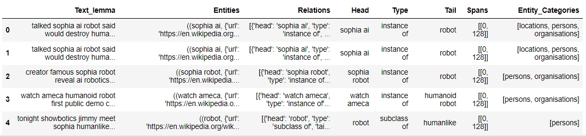
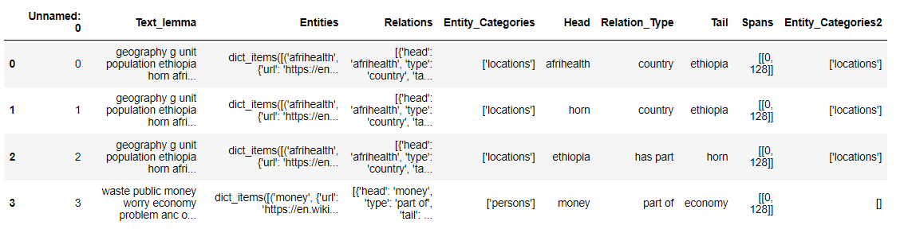
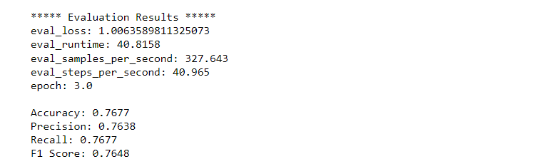
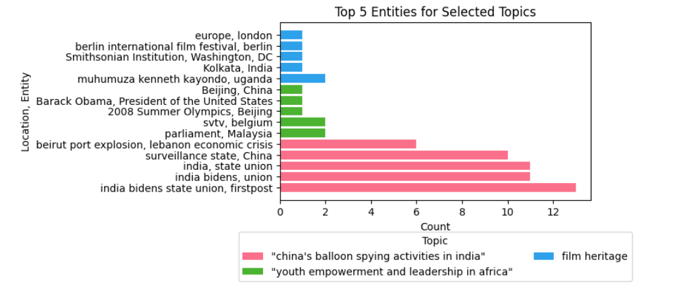
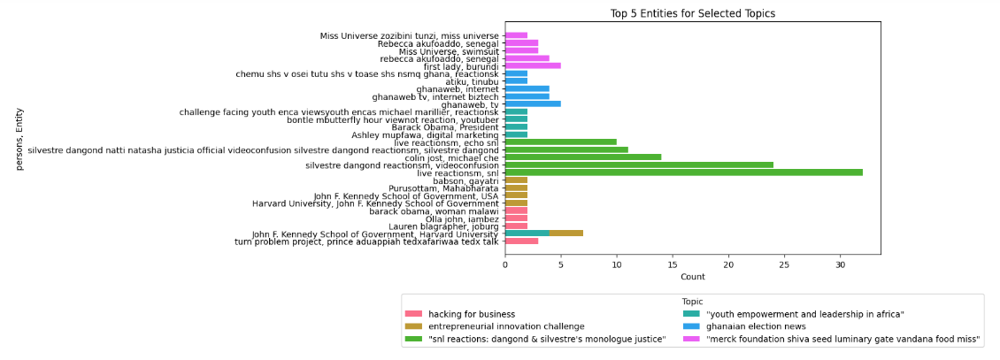
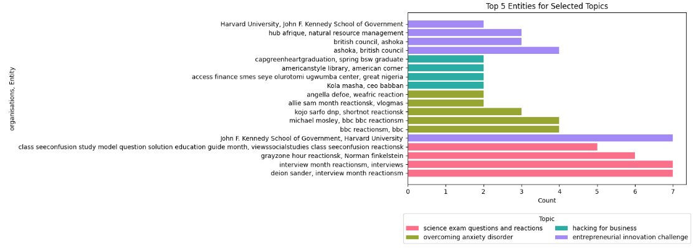
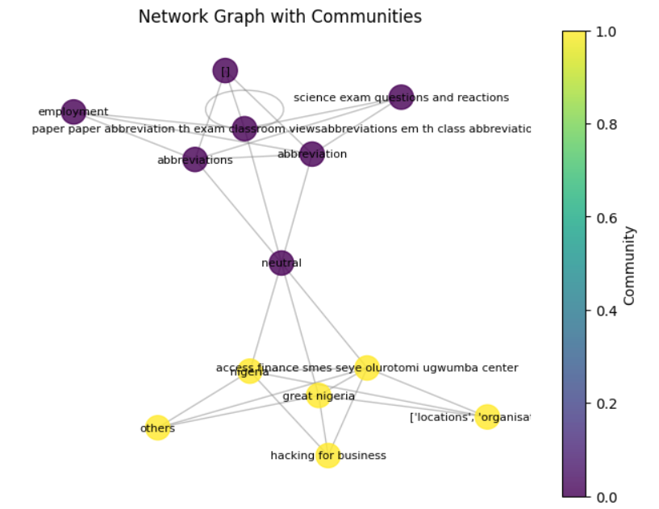
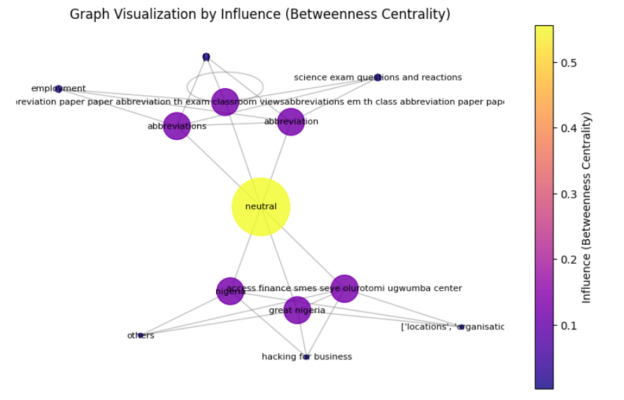
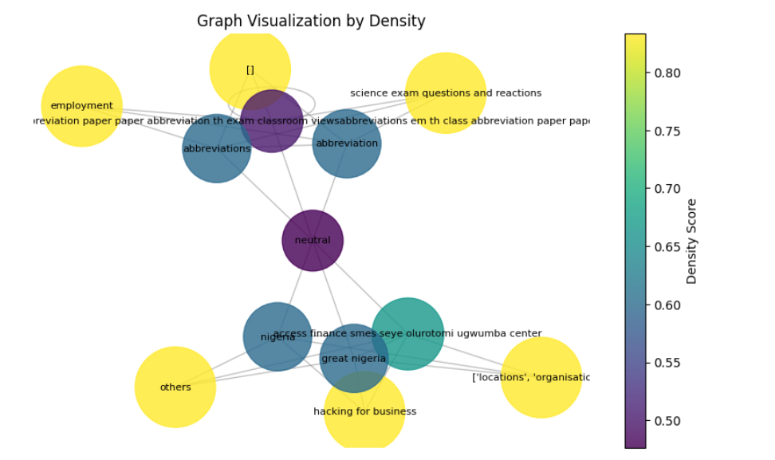

# Generating Joint Entities and Relation Types

This document provides a comprehensive guide on extracting entities and their relationships from text data using the **REBEL model**, integrating the output into a structured knowledge base, and further processing and categorizing the results using Python and **spaCy**.

### Key Concepts
1. **Entities**: Named objects in text (e.g., people, places, organizations).
2. **Relations**: Connections or relationships between entities (e.g., "is located in," "is part of").

### Workflow
1. Extract relations using the REBEL model.
2. Build a knowledge base (KB) to store entities and relationships.
3. Categorize entities using **spaCy** Named Entity Recognition (NER).
4. Process and store results in structured formats for analysis.

---

## Code Snippets and Explanations

### 1. **Initial Setup**

Set up the required libraries and load the models for text processing.

```python
import torch
from transformers import AutoModelForSeq2SeqLM, AutoTokenizer
import spacy
import pandas as pd
from ast import literal_eval

# Load spaCy model
nlp = spacy.load("en_core_web_md")

# Load the REBEL model and tokenizer
device = torch.device("cuda" if torch.cuda.is_available() else "cpu")
tokenizer = AutoTokenizer.from_pretrained("Babelscape/rebel-large")
model = AutoModelForSeq2SeqLM.from_pretrained("Babelscape/rebel-large").to(device)
```

---

### 2. **Relation Extraction**

Define a function to decode the REBEL model's output into structured relationships.

```python
def extract_relations_from_model_output(text):
    relations = []
    relation, subject, object_ = '', '', ''
    current = None
    text_replaced = text.replace("<s>", "").replace("<pad>", "").replace("</s>", "")

    for token in text_replaced.split():
        if token == "<triplet>":
            if relation:
                relations.append({'head': subject.strip(), 'type': relation.strip(), 'tail': object_.strip()})
                relation, subject, object_ = '', '', ''
            current = 'subject'
        elif token == "<subj>":
            current = 'subject'
        elif token == "<obj>":
            current = 'object'
        else:
            if current == 'subject':
                subject += f" {token}"
            elif current == 'object':
                object_ += f" {token}"
            else:
                relation += f" {token}"

    if subject and relation and object_:
        relations.append({'head': subject.strip(), 'type': relation.strip(), 'tail': object_.strip()})
    
    return relations
```

---

### 3. **Processing Text**

Process text data using the REBEL model, extract relations, and structure them into a knowledge base.

```python
class KB:
    def __init__(self):
        self.entities = {}
        self.relations = []

    def add_entity(self, entity_name):
        if entity_name not in self.entities:
            self.entities[entity_name] = {"title": entity_name}

    def add_relation(self, relation):
        if relation not in self.relations:
            self.relations.append(relation)

def from_text_to_kb(text, span_length=128):
    inputs = tokenizer([text], return_tensors="pt", max_length=span_length, truncation=True).to(device)
    generated_tokens = model.generate(**inputs, max_length=64, num_beams=3, num_return_sequences=3)
    decoded_preds = tokenizer.batch_decode(generated_tokens, skip_special_tokens=False)

    kb = KB()
    for pred in decoded_preds:
        relations = extract_relations_from_model_output(pred)
        for relation in relations:
            kb.add_entity(relation["head"])
            kb.add_entity(relation["tail"])
            kb.add_relation(relation)
    
    return kb
```

---

### 4. **Entity Categorization with spaCy**

Categorize entities using spaCy's NER for additional metadata.

```python
def extract_entity_categories(text):
    doc = nlp(str(text))
    entity_categories = set()

    for ent in doc.ents:
        if ent.label_ == 'PERSON':
            entity_categories.add('persons')
        elif ent.label_ == 'ORG':
            entity_categories.add('organisations')
        elif ent.label_ == 'GPE':
            entity_categories.add('locations')

    return list(entity_categories)
```
---

### 5. **Processing and Expanding Relations**

Process the extracted relations, expand them into a detailed format, and save them to a new DataFrame.

```python
# Load the original DataFrame
df_original = pd.read_csv('path_to_original_file.csv')

# List to store expanded rows
rows = []

# Iterate through each row in the original DataFrame
for index, row in df_original.iterrows():
    relations = literal_eval(row['Relations'])

    for relation_entry in relations:
        rows.append({
            'sourcetype': row['sourcetype'],
            'Views': row['Views'],
            'Date': row['Date'],
            'textid': row['textid'],
            'alltext': row['alltext'],
            'llama2_labelone': row['llama2_labelone'],
            'cleaned_theme': row['cleaned_theme'],
            'llama2_labelone10': row['llama2_labelone10'],
            'Predicted_Categories3': row['Predicted_Categories3'],
            'llama3_sentiment': row['llama3_sentiment'],
            'Text_lemma': row['Text_lemma'],
            'Entities': row['Entities'],
            'Relations': row['Relations'],
            'Entity_Categories': row['Entity_Categories'],
            'Head': relation_entry['head'],
            'Relation_Type': relation_entry['type'],
            'Tail': relation_entry['tail'],
            'Spans': relation_entry['meta']['spans']
        })

new_df['Entity_Categories2'] = new_df.apply(
    lambda row: extract_entity_categories((row['Head'], row['Relation_Type'], row['Tail'])), axis=1
)
```


### Evaluating Categories of Entities Generated

This section evaluates the performance of a BERT-based classification model to predict entity categories. The process is broken into manageable steps:

---

#### Step 1: Dataset Preparation

We start by preparing the dataset, mapping entity categories to numerical labels, and splitting it into training and testing sets.

```python
from sklearn.model_selection import train_test_split

# Convert the 'Entity_Categories2' column to strings and map them to numerical labels
df['category'] = df['Entity_Categories2'].apply(lambda x: str(x))
df['label_id'] = df['category'].astype('category').cat.codes

# Split dataset into training and testing sets
train_df, test_df = train_test_split(df, test_size=0.2, random_state=42)

print(f"Training set size: {len(train_df)}, Test set size: {len(test_df)}")
```

---

#### Step 2: BERT Tokenization and Dataset Class

We create a custom dataset class for tokenizing input data and preparing it for the BERT model.

```python
from transformers import BertTokenizer
from torch.utils.data import Dataset
import torch

# Load the pre-trained BERT tokenizer
tokenizer = BertTokenizer.from_pretrained("bert-base-uncased")

class CustomDataset(Dataset):
    def __init__(self, df, max_length=128):
        self.df = df
        self.max_length = max_length

    def __len__(self):
        return len(self.df)

    def __getitem__(self, idx):
        # Tokenize the input text
        inputs = tokenizer(
            self.df.iloc[idx]["Text_lemma"],  # Text input column
            padding="max_length",
            truncation=True,
            max_length=self.max_length,
            return_tensors="pt",
        )
        # Retrieve the label
        label = torch.tensor(self.df.iloc[idx]["label_id"]).long()
        return {"input_ids": inputs["input_ids"].squeeze(), 
                "attention_mask": inputs["attention_mask"].squeeze(), 
                "label": label}
```

---

#### Step 3: BERT Model Initialization

Initialize a BERT model for sequence classification, configured with the number of unique labels.

```python
from transformers import BertForSequenceClassification

# Count the unique labels for classification
num_labels = len(df['label_id'].unique())

# Load the BERT model for classification
model = BertForSequenceClassification.from_pretrained("bert-base-uncased", num_labels=num_labels)

print(f"BERT model initialized with {num_labels} labels.")
```

---

#### Step 4: Training in Chunks

The training process is conducted in chunks to handle memory constraints effectively.

```python
from transformers import Trainer, TrainingArguments

# Define training arguments
training_args = TrainingArguments(
    output_dir="./bert_joint_entity_relation",
    per_device_train_batch_size=8,
    save_total_limit=1,
    num_train_epochs=3,
    evaluation_strategy="steps",
    eval_steps=100,
    logging_steps=100,
)

# Initialize the Trainer
trainer = Trainer(
    model=model,
    args=training_args,
)

# Train the model in chunks
chunk_size = 1000
for start in range(0, len(train_df), chunk_size):
    end = start + chunk_size
    chunk_train_df = train_df.iloc[start:end]
    chunk_train_dataset = CustomDataset(chunk_train_df)
    trainer.train_dataset = chunk_train_dataset
    trainer.train()

print("Model training completed.")
```

---

#### Step 5: Evaluation and Metrics

Evaluate the trained model on the test dataset and calculate performance metrics.

```python
from sklearn.metrics import accuracy_score, precision_recall_fscore_support

# Prepare the test dataset
test_dataset = CustomDataset(test_df)

# Evaluate the model
results = trainer.evaluate(test_dataset)

# Generate predictions
predictions = trainer.predict(test_dataset)
predicted_labels = torch.argmax(torch.from_numpy(predictions.predictions), dim=1).tolist()
true_labels = test_df['label_id'].tolist()

# Calculate metrics
accuracy = accuracy_score(true_labels, predicted_labels)
precision, recall, f1, _ = precision_recall_fscore_support(true_labels, predicted_labels, average='weighted')

print(f"Accuracy: {accuracy:.4f}")
print(f"Precision: {precision:.4f}, Recall: {recall:.4f}, F1 Score: {f1:.4f}")
```

---

### Viewing Entities for Specific Topics

This demonstrates how to analyze and visualize top entities for specific topics.

```python
df['location_entity'] = df['Head'] + ', ' + df['Tail']
filtered_df = df[df['Entity_Categories2'].apply(lambda x: 'locations' in x)]
grouped = filtered_df.groupby(['llama2_labelone', 'location_entity']).size().reset_index(name='count')
```

#### Top Topics & locations

```python
topic_counts = grouped.groupby('llama2_labelone').size()
filtered_topics = topic_counts[(topic_counts >= 20) & (topic_counts <= 23)].index
filtered_data = grouped[grouped['llama2_labelone'].isin(filtered_topics)]

# Plotting
```


#### Top topics and Persons Entities

1. **Filter & Group**: Filter for `persons` and group similarly.

```python
df['persons_entity'] = df['Head'] + ', ' + df['Tail']
filtered_df = df[df['Entity_Categories2'].apply(lambda x: 'persons' in x)]
grouped = filtered_df.groupby(['llama2_labelone', 'persons_entity']).size().reset_index(name='count')
```

2. **Top Topics & Plot**: Visualize top 5 person entities.

```python
filtered_topics = grouped.groupby('llama2_labelone').size().between(50, 150).index
filtered_data = grouped[grouped['llama2_labelone'].isin(filtered_topics)]
top_topics = filtered_data['llama2_labelone'].value_counts().head(10).index

# Plot
```



#### Top topics and Organisations Entities

1. **Filter & Group**: Filter for `organisations` and group similarly.

```python
df['organisations_entity'] = df['Head'] + ', ' + df['Tail']
filtered_df = df[df['Entity_Categories2'].apply(lambda x: 'organisations' in x)]
grouped = filtered_df.groupby(['llama2_labelone', 'organisations_entity']).size().reset_index(name='count')
```

2. **Top Topics & Plot**: Visualize the top 5 organization entities.

```python
filtered_topics = grouped.groupby('llama2_labelone').size().between(50, 210).index
filtered_data = grouped[grouped['llama2_labelone'].isin(filtered_topics)]
top_topics = filtered_data['llama2_labelone'].value_counts().head(10).index

# Plot
```



# Social Network Analysis Based on Entities (Persons, Organisations, Locations)

This document provides an overview of a Social Network Analysis (SNA) pipeline that processes and analyzes entities of persons, organisations, and locations based on various network attributes, including community detection, influence, and link analysis. The analysis is performed using data stored in a DataFrame (`df_expanded`) and utilizes various techniques such as Graph Convolutional Networks (GCNs), Louvain community detection, UMAP for dimensionality reduction, and node classification based on clustering and centrality metrics.

The following steps outline the implementation of the network analysis pipeline:

## 1. Data Preprocessing

We begin by filtering the dataset into three categories: persons, organisations, and locations.

```python
# Filter rows where 'people' is in the list within the 'category' column
df_people = df_expanded[df_expanded['category'].apply(lambda x: 'persons' in x)]
df_org = df_expanded[df_expanded['category'].apply(lambda x: 'organisations' in x)]
df_country = df_expanded[df_expanded['category'].apply(lambda x: 'locations' in x)]

# Check the shape of the resulting dataframe
df_people.shape
df_org.shape
df_country.shape
```

## 2. Graph Construction

The next step involves creating a directed graph (`DiGraph`) from the data. Nodes represent entities such as topics, sentiments, themes, categories, and the actual entities (persons, organisations, locations), while edges are formed based on relationships (e.g., `Relations` column).

```python
import ast
import networkx as nx

# Create a directed graph from the data
G = nx.DiGraph()

# Add nodes and edges to the graph
for _, row in df_subset.iterrows():
    topic = row['topic']
    sentiment = row['sentiment']
    relations = ast.literal_eval(row['Relations'])
    category = row['category']
    theme = row['theme']
    entities = [row['Head'], row['Tail']]
    time = row['Date']

    # Add nodes with type and time attributes
    G.add_node(topic, type='Topic', time=time)
    G.add_node(sentiment, type='Sentiment', time=time)
    G.add_node(theme, type='Theme', time=time)
    G.add_node(category, type='Category', time=time)

    for entity in entities:
        G.add_node(entity, type='Entity', time=time)

    # Add edges from Relations
    for relation in relations:
        head = relation['head']
        relation_type = relation['type']
        tail = relation['tail']
        G.add_edge(head, tail, type=relation_type, time=time)
        G.add_edge(head, sentiment, type='Sentiment', time=time)
        G.add_edge(head, theme, type='Theme', time=time)
        G.add_edge(head, category, type='Category', time=time)
        G.add_edge(head, topic, type='Topic', time=time)

        G.add_edge(tail, sentiment, type='Sentiment', time=time)
        G.add_edge(tail, theme, type='Theme', time=time)
        G.add_edge(tail, category, type='Category', time=time)
        G.add_edge(tail, topic, type='Topic', time=time)

# Convert to undirected graph for community detection
G_undirected = G.to_undirected()
```

## 3. Community Detection

Community detection helps to uncover groups of nodes with strong interconnections. We apply the Louvain method, which is effective in detecting communities in large networks.

### 3.1 Louvain Modularity (Community Detection)

- **Objective:** Detect communities within the network using the Louvain method, based on the modularity optimization.
- **Method:** The Louvain algorithm maximizes the modularity score by iteratively moving nodes between communities to increase the density of intra-community edges.
- **Result:** The output will show the communities identified by the Louvain method, along with the modularity score, which indicates how well the community structure fits the graph.

```python
import community as community_louvain
import matplotlib.pyplot as plt

# Detect communities using Louvain method
node_community = community_louvain.best_partition(G_undirected)

# Assign the community as an attribute to each node
for node, community in node_community.items():
    G_undirected.nodes[node]['community'] = community

# Visualize the graph with nodes colored by community
plt.figure(figsize=(10, 7))
pos = nx.spring_layout(G_undirected, seed=42)
node_colors = [node_community.get(node, -1) for node in G_undirected.nodes]

# Draw the graph
nodes = nx.draw_networkx_nodes(G_undirected, pos, node_color=node_colors, cmap='viridis', node_size=300, alpha=0.8)
nx.draw_networkx_edges(G_undirected, pos, edge_color='gray', alpha=0.5)
nx.draw_networkx_labels(G_undirected, pos, font_size=8, font_color='black')

# Add a color bar to represent communities
plt.colorbar(nodes, label='Community')
plt.title("Network Graph with Communities")
plt.axis("off")
plt.show()
```

---

## 4. Clustering Coefficient

- **Objective:** Measure how nodes are clustered together within communities, providing insights into the cohesiveness of these communities.
- **Method:** The clustering coefficient for each node will be calculated. This is done by looking at the proportion of a node’s neighbors that are also connected to each other.
- **Result:** The higher the clustering coefficient, the more tightly knit the community is. This can help in identifying strong communities where members are highly interdependent.

```python
# Compute the clustering coefficient for each node
clustering_coeffs = nx.clustering(G_undirected)

# Visualize the clustering coefficient distribution
plt.hist(list(clustering_coeffs.values()), bins=30, color='skyblue', edgecolor='black')
plt.title("Clustering Coefficients Distribution")
plt.xlabel("Clustering Coefficient")
plt.ylabel("Frequency")
plt.show()
```

---

## 5. Degree Centrality

- **Objective:** Identify the most central and influential nodes within each community.
- **Method:** Degree centrality is calculated by simply counting the number of edges connected to each node. A higher degree centrality indicates a node is more central and influential in its community.
- **Result:** We will rank the nodes in each community by their degree centrality and identify influential nodes or "hubs."

```python
# Compute the degree centrality for each node
degree_centrality = nx.degree_centrality(G_undirected)

# Assign degree centrality as an attribute to each node
for node, degree in degree_centrality.items():
    G_undirected.nodes[node]['degree_centrality'] = degree

# Visualize degree centrality for nodes
plt.hist(list(degree_centrality.values()), bins=30, color='lightgreen', edgecolor='black')
plt.title("Degree Centrality Distribution")
plt.xlabel("Degree Centrality")
plt.ylabel("Frequency")
plt.show()

# Save the graph with community information
nx.write_gexf(G_undirected, "community_graph_people.gexf")
```

## 6. Influence Analysis Based on Centrality Measures

In this section, we analyze the influence of nodes in the network using various centrality measures. These measures help identify key players or nodes that are important for information flow, communication, and network efficiency. We will explore **Betweenness Centrality**, **Closeness Centrality**, and **Eigenvector Centrality**.

### 6.1 Betweenness Centrality

- **Objective:** Betweenness centrality measures the number of times a node lies on the shortest path between two other nodes. It helps identify nodes that act as bridges or intermediaries in the network, which can control the flow of information.
- **Relevance:** Nodes with high betweenness centrality have the ability to influence the flow of information or resources between different communities or parts of the network.
  
```python
# Compute the betweenness centrality for each node
betweenness_centrality = nx.betweenness_centrality(G_undirected)

# Assign betweenness centrality as an attribute to each node
for node, betweenness in betweenness_centrality.items():
    G_undirected.nodes[node]['betweenness_centrality'] = betweenness

# Visualize betweenness centrality for nodes
plt.hist(list(betweenness_centrality.values()), bins=30, color='coral', edgecolor='black')
plt.title("Betweenness Centrality Distribution")
plt.xlabel("Betweenness Centrality")
plt.ylabel("Frequency")
plt.show()
```

### 6.2 Closeness Centrality

- **Objective:** Closeness centrality measures how close a node is to all other nodes in the network, based on the shortest paths. It helps identify nodes that can spread information quickly across the network.
- **Relevance:** Nodes with high closeness centrality are important for rapid communication and information diffusion, as they can reach other nodes with fewer hops.

```python
# Compute the closeness centrality for each node
closeness_centrality = nx.closeness_centrality(G_undirected)

# Assign closeness centrality as an attribute to each node
for node, closeness in closeness_centrality.items():
    G_undirected.nodes[node]['closeness_centrality'] = closeness

# Visualize closeness centrality for nodes
plt.hist(list(closeness_centrality.values()), bins=30, color='lightblue', edgecolor='black')
plt.title("Closeness Centrality Distribution")
plt.xlabel("Closeness Centrality")
plt.ylabel("Frequency")
plt.show()
```

### 6.3 Eigenvector Centrality

- **Objective:** Eigenvector centrality measures a node’s influence based on the influence of its neighbors. A node is considered influential if it is connected to other influential nodes, not just a high number of nodes.
- **Relevance:** This centrality measure helps identify nodes that are not only well-connected but also connected to other well-connected or influential nodes. It is useful for understanding the broader impact and power of nodes in the network.

```python
# Compute the eigenvector centrality for each node
eigenvector_centrality = nx.eigenvector_centrality(G_undirected, max_iter=1000)

# Assign eigenvector centrality as an attribute to each node
for node, eigenvector in eigenvector_centrality.items():
    G_undirected.nodes[node]['eigenvector_centrality'] = eigenvector

# Visualize eigenvector centrality for nodes
plt.hist(list(eigenvector_centrality.values()), bins=30, color='lightgreen', edgecolor='black')
plt.title("Eigenvector Centrality Distribution")
plt.xlabel("Eigenvector Centrality")
plt.ylabel("Frequency")
plt.show()
```


### Link Analysis: PageRank and Density-Based Methods

In this section, we extend our link analysis to provide insights into the structure of the graph using two distinct methods: **PageRank** and **Density-Based Analysis**. These methods help in identifying influential nodes and understanding local neighborhood connectivity, respectively.

#### PageRank Analysis

PageRank is a widely used algorithm that assigns a numerical weight to each node in the graph, indicating its relative importance within the network. Higher PageRank scores suggest nodes that are central or influential.

**PageRank Calculation**  
   Using the NetworkX implementation, we calculate the PageRank scores for each node in the undirected graph:
   Nodes are visualized with sizes proportional to their PageRank scores. A `spring_layout` algorithm is used for positioning, and node colors represent their importance:

   ```python
   plt.figure(figsize=(10, 6))
   pos = nx.spring_layout(G_undirected, seed=42)
   node_sizes = [5000 * pagerank_scores[node] for node in G_undirected.nodes()]
   nodes = nx.draw_networkx_nodes(
       G_undirected, pos,
       node_size=node_sizes,
       node_color=list(pagerank_scores.values()),
       cmap='viridis', alpha=0.8
   )
   
   ```

 #### Density-Based Analysis

Density analysis measures the density of each node's local neighborhood to understand its connectivity relative to its neighbors.

1. **Neighborhood Density Calculation**  
   The density of a node's neighborhood is computed as the ratio of edges present to the maximum possible edges within its subgraph (including the node itself):

   ```python
   density_scores = {}
   for node in G_undirected.nodes:
       neighbors = list(G_undirected.neighbors(node))
       subgraph = G_undirected.subgraph(neighbors + [node])  # Include the node itself
       density_scores[node] = nx.density(subgraph)
   ```

   These scores are added to the graph as node attributes:

   ```python
   nx.set_node_attributes(G_undirected, density_scores, "density")
   ```

2. **Visualization by Density**  
   Nodes are visualized with sizes proportional to their density scores, providing insights into localized clustering:

   ```python
   plt.figure(figsize=(10, 6))
   pos = nx.spring_layout(G_undirected, seed=42)
   node_sizes = [5000 * density_scores[node] for node in G_undirected.nodes()]
   nodes = nx.draw_networkx_nodes(
       G_undirected, pos,
       node_size=node_sizes,
       node_color=list(density_scores.values()),
       cmap='viridis', alpha=0.8
   )
   ```


### Conclusion for Social Network Analysis

We analyzed networks of **people**, **countries**, and **organizations**, focusing on key aspects:  

- **Community Detection**: Using metrics like **modularity** and **clustering coefficients** and **degree centrality**.  
- **Influence Analysis**: Employing **closeness**, **betweenness**, and **eigenvector centrality**.  
- **Link Analysis**: Examining **density**and **pagerank**  

All networks were stored and uploaded to **Gephi** for deeper exploration, providing insights into influence, community structures, and relationship dynamics.