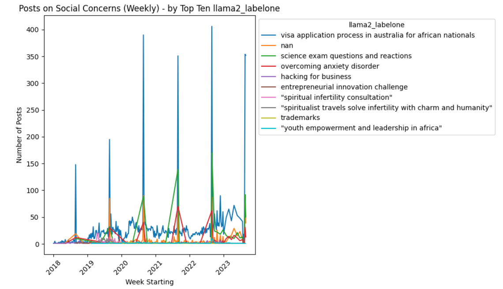
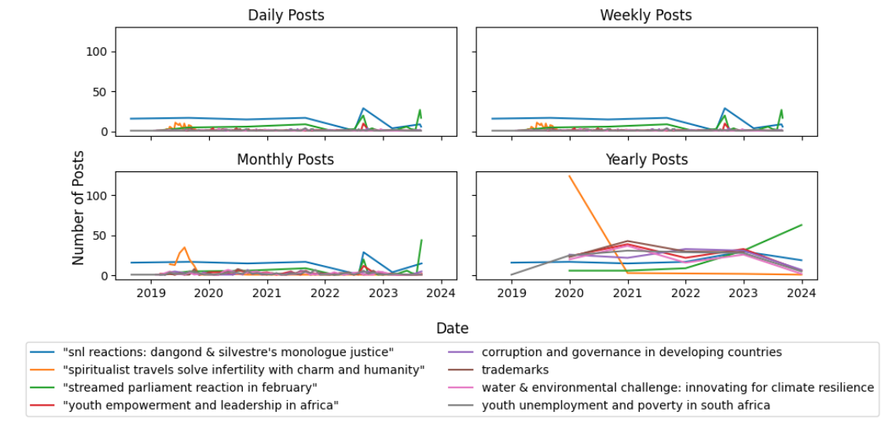
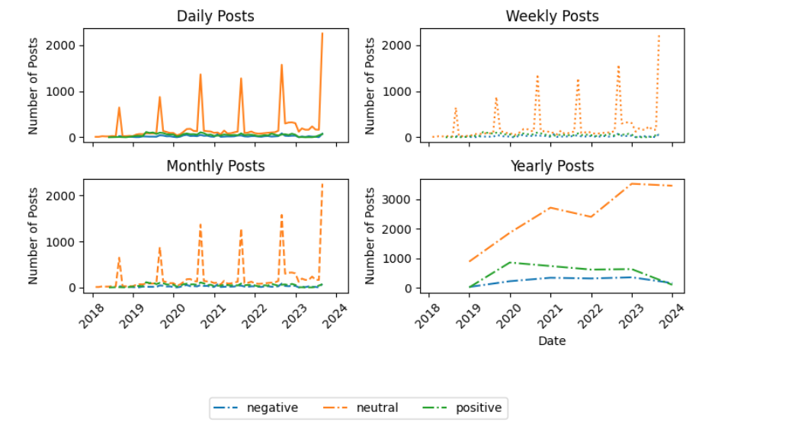
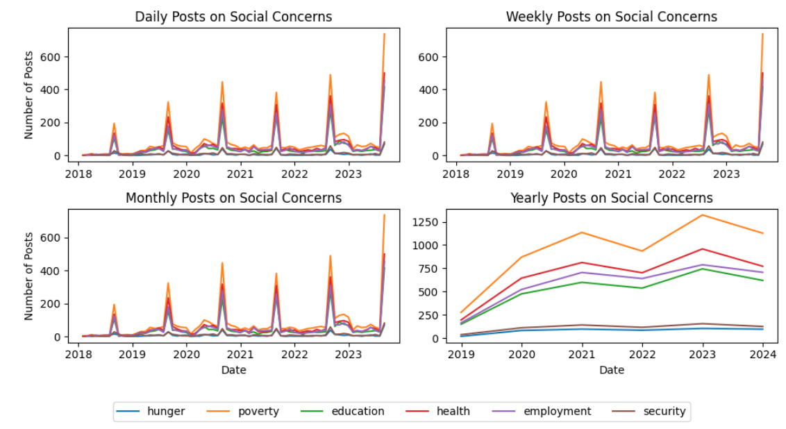
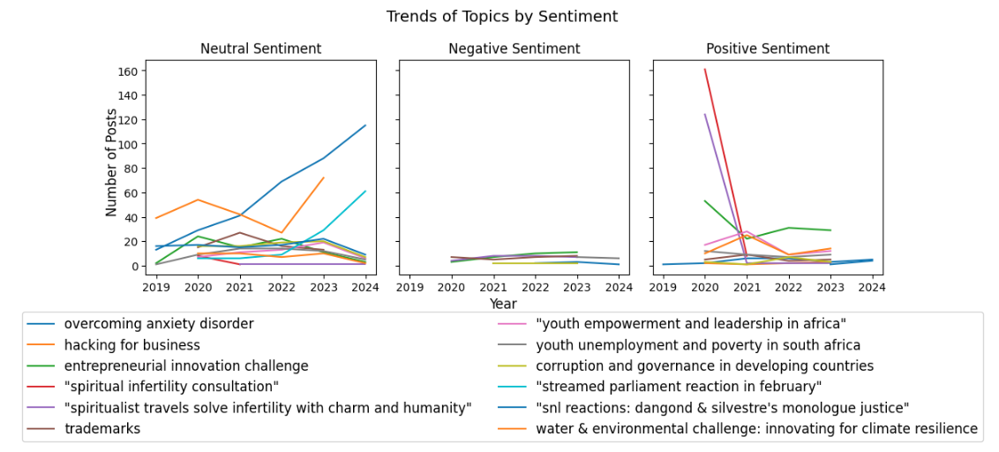
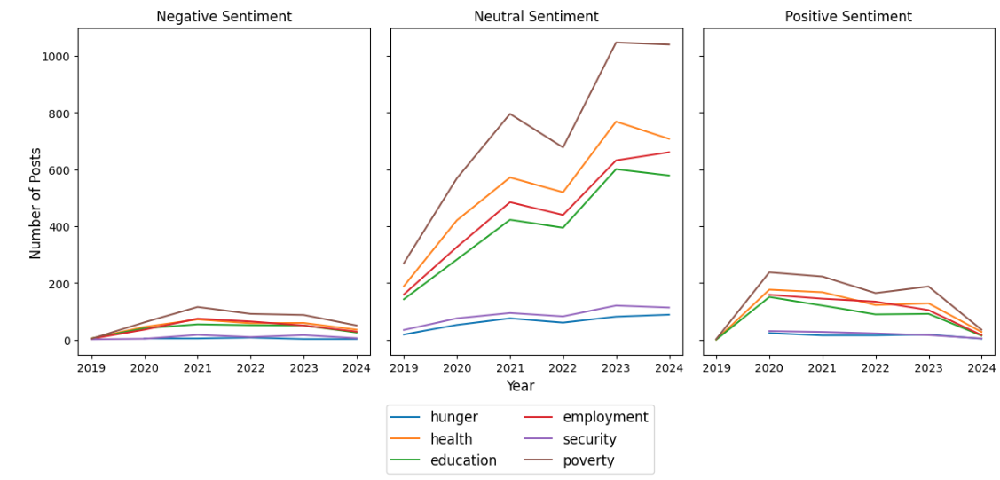
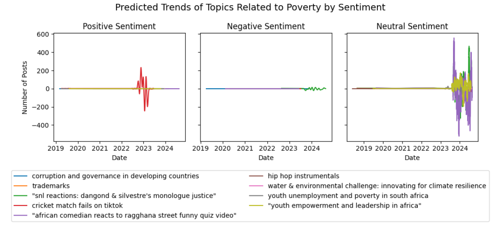

# Trend Analysis Using Time Series Data
This document explains the process of performing trend analysis on time series data using Python libraries such as Pandas, spaCy, and Statsmodels. For Temporal analysis, we do two tasks, Observing trends and time series prediction for future trends.

# 1. Observing Trends

This section focuses on extracting and visualizing trends from time series data.

### 1.1 Extracting and Processing Date Data

We begin by extracting and processing date information from the dataset. The `Date_Extracted` field is initially assumed to be in a non-datetime format, such as a string. To make it usable for trend analysis, we convert it into a `datetime` object using Pandas' `to_datetime` method.

```python
# Convert 'Date' to datetime
df['Date_Extracted'] = pd.to_datetime(df['Date'])
```

### 1.2 Extract Year and Month

After converting the date field, we extract the **year** and **month** from the `Date_Extracted` column. This step helps in grouping data by year and month.

```python
# Extract year and month from the Date
df['Year_Extracted'] = df['Date_Extracted'].dt.year.astype('Int64')
df['year-month'] = df['Date_Extracted'].dt.to_period('M')
df['Date (by month)'] = df['year-month'].apply(lambda x: x.to_timestamp() if pd.notna(x) else pd.NaT)
```

### 1.3 Date Extraction Using spaCy

To refine the date extraction, we use the spaCy library to extract date entities from textual data.

```python
import spacy
nlp = spacy.load('en_core_web_sm')

def extract_dates(text):
    doc = nlp(text)
    dates = [ent.text for ent in doc.ents if ent.label_ == 'DATE']
    if dates:
        try:
            return pd.to_datetime(dates[0], errors='coerce')
        except ValueError:
            return pd.NaT
    else:
        return pd.NaT

df['Date_Extracted'] = df['Date'].apply(extract_dates)
```

### 1.4 Setting Year and Month as Index

Once the dates are extracted, we set the **year and month** as the index in the Pandas DataFrame. This allows us to aggregate data by time periods (e.g., months) easily.

```python
df = df.set_index('Date (by month)')
```

### 1.5 Grouping and Visualizing Data

We group the data by time periods and categories to observe trends. For example, grouping by `llama2_labelone` and plotting the number of posts:

```python
aggr_df = df.groupby(['llama2_labelone', pd.Grouper(key='Date', freq='M')])['Text_lemma'].count().reset_index()
aggr_df.columns = ['llama2_labelone', 'Date', 'Posts']
```

#### Visualization Example

We plot the number of posts for the top topics using Matplotlib.

```python
import matplotlib.pyplot as plt

# Plotting posts for the top 10 'llama2_labelone'
plt.figure(figsize=(10, 6))

for label in top_ten_labels:
    label_data = aggr_df_top_ten[aggr_df_top_ten['llama2_labelone'] == label]
    plt.plot(label_data['Date'], label_data['Posts'], label=label)

plt.title('Posts on Social Concerns (Weekly) - by Top Ten llama2_labelone')
plt.xlabel('Week Starting')
plt.ylabel('Number of Posts')
plt.legend(title='llama2_labelone', loc='upper left', bbox_to_anchor=(1, 1))
plt.xticks(rotation=45)
plt.tight_layout()
plt.show()
```


### Post Frequency Analysis: Top Ten Topics

This script aggregates and visualizes post data for the top ten topics across different timeframes: daily, weekly, monthly, and yearly.

```python
import pandas as pd
import matplotlib.pyplot as plt

# Convert 'Date' column to datetime
df['Date'] = pd.to_datetime(df['Date'])

# Aggregate data for daily, weekly, monthly, and yearly
aggr_df_daily = df.groupby(['llama2_labelone', pd.Grouper(key='Date', freq='D')])['Text_lemma'].count().reset_index()
aggr_df_weekly = df.groupby(['llama2_labelone', pd.Grouper(key='Date', freq='W-MON')])['Text_lemma'].count().reset_index()
aggr_df_monthly = df.groupby(['llama2_labelone', pd.Grouper(key='Date', freq='M')])['Text_lemma'].count().reset_index()
aggr_df_yearly = df.groupby(['llama2_labelone', pd.Grouper(key='Date', freq='Y')])['Text_lemma'].count().reset_index()

# Get the top ten topics
total_posts = aggr_df_weekly.groupby('llama2_labelone')['Posts'].sum().reset_index()
top_ten_labels = total_posts[(total_posts['Posts'] >= 100) & (total_posts['Posts'] <= 150)]['llama2_labelone']

# Filter data for the top ten topics
aggr_df_top_ten = {freq: df[df['llama2_labelone'].isin(top_ten_labels)] for freq, df in 
                   [('daily', aggr_df_daily), ('weekly', aggr_df_weekly), ('monthly', aggr_df_monthly), ('yearly', aggr_df_yearly)]}

```

The output consists of four line plots visualizing the post frequency for the top ten topics.



## Observing Sentiment Trends Over Time

This guide visualizes trends in sentiment (positive, neutral, negative) across daily, weekly, monthly, and yearly frequencies, helping us understand how sentiment evolves over time.

- Convert `Date` to a datetime format and set it as the DataFrame index.
- Group the data by sentiment (`llama3_sentiment`) and resample for daily, weekly, monthly, and yearly frequencies.

   ```python
   # Group by 'Keysector' and 'Date' and count the posts
   aggr_df = df.groupby(['llama3_sentiment', pd.Grouper(key='Date', freq='M')])['Text_lemma'].count().reset_index()
   aggr_df.columns = ['llama3_sentiment', 'Date', 'Posts']
   
   aggr_df['Date'] = pd.to_datetime(aggr_df['Date'])
   aggr_df.set_index('Date', inplace=True)

   daily_data = aggr_df.groupby([pd.Grouper(freq='D'), 'llama3_sentiment'])['Posts'].sum().reset_index()
   weekly_data = aggr_df.groupby([pd.Grouper(freq='W'), 'llama3_sentiment'])['Posts'].sum().reset_index()
   monthly_data = aggr_df.groupby([pd.Grouper(freq='M'), 'llama3_sentiment'])['Posts'].sum().reset_index()
   yearly_data = aggr_df.groupby([pd.Grouper(freq='Y'), 'llama3_sentiment'])['Posts'].sum().reset_index()
   ```



## Observing Trends of Themes

This analysis tracks trends of social issues (e.g., hunger, poverty, education) over daily, weekly, monthly, and yearly intervals.
   - Convert `Date` to datetime format and filter data by relevant themes (e.g., hunger, poverty).

   ```python
   aggr_df = df.groupby(['Predicted_Categories3', pd.Grouper(key='Date', freq='M')])['Text_lemma'].count().reset_index()
   aggr_df.columns = ['Predicted_Categories3', 'Date', 'Posts']

   for theme in themes_to_include:
       theme_df = aggr_df[aggr_df['Predicted_Categories3'].apply(lambda x: theme in x)].copy()
       theme_df['Filtered_Theme'] = theme
       all_themes_df = pd.concat([all_themes_df, theme_df])
   ```

**Aggregation**:
   - Group data by `Date` and `Filtered_Theme` for daily, weekly, monthly, and yearly sums.
   
   ```python
   daily_data = all_themes_df.groupby([pd.Grouper(key='Date', freq='D'), 'Filtered_Theme']).sum().reset_index()
   ```

**Visualization**:
   - Plot trends for each frequency in a 2x2 grid of subplots.




### Observing Topics and Sentiments
We analyze the trends of topics and their associated sentiments over time. The steps below include filtering the data for specific topic ranges and visualizing the number of posts for each sentiment.

```python
import pandas as pd
import matplotlib.pyplot as plt

# Assuming 'df' is your DataFrame and is already loaded

# Convert 'Date' column to datetime if it's not already
df['Date'] = pd.to_datetime(df['Date'])

# Filter topics that have a count between 50 and 100
topic_counts = df['llama2_labelone'].value_counts()
top_themes = topic_counts[(topic_counts >= 100) & (topic_counts <= 500)].index

# Filter the DataFrame to include only rows with the selected topics
filtered_df = df[df['llama2_labelone'].isin(top_themes)]

# Group by 'llama2_labelone', 'Date', and 'llama3_sentiment', and count the posts
aggr_df = filtered_df.groupby(['llama2_labelone', pd.Grouper(key='Date', freq='Y'), 'llama3_sentiment'])['Text_lemma'].count().reset_index()
aggr_df.columns = ['llama2_labelone', 'Date', 'llama3_sentiment', 'Posts']

# Get unique sentiments and filtered top themes for plotting
unique_sentiments = aggr_df['llama3_sentiment'].unique()

# Create a grid of subplots
fig, axes = plt.subplots(nrows=1, ncols=3, figsize=(10, 4), sharex=True, sharey=True)

# Flatten the axes array for easier iteration
axes = axes.flatten()

# Plot data for each sentiment and topic in subplots
handles = []  # Store handles for the legend
labels = []  # Store labels for the legend

for i, sentiment in enumerate(unique_sentiments):
    sentiment_data = aggr_df[aggr_df['llama3_sentiment'] == sentiment]
    
    for j, topic in enumerate(top_themes):
        topic_data = sentiment_data[sentiment_data['llama2_labelone'] == topic]
        if not topic_data.empty:
            ax = axes[i]  # Use one of the subplots axes
            line, = ax.plot(topic_data['Date'], topic_data['Posts'], label=f'{topic}')  # Only the topic name in the legend
            
            # Collect the handles and labels once to ensure all are included in the final legend
            if topic not in labels:
                handles.append(line)
                labels.append(topic)
    
    # Set title for each subplot
    ax.set_title(f'{sentiment.capitalize()} Sentiment')
```
This visualization helps in identifying trends for specific topics across different sentiment categories over time.


---
## Observing Trends of Themes by Sentiment

### 1. Data Preparation
```python
#Convert the `Date` column to datetime.
#Filter rows where `Predicted_Categories3` contains themes: `['hunger', 'health', 'education', 'employment', 'security', 'poverty']`.
#Group by `theme`, `Date`, and `llama3_sentiment` to count posts.

   
   filtered_df = pd.concat([
       df[df['Predicted_Categories3'].str.contains(theme, case=False, na=False)].assign(theme=theme)
       for theme in themes
   ])
   aggr_df = filtered_df.groupby(
       ['theme', pd.Grouper(key='Date', freq='Y'), 'llama3_sentiment']
   )['Text_lemma'].count().reset_index()
```


# 2. Forecasting Trends

In this section, we prepare the data for forecasting by ensuring stationarity and applying time series models.

### 2.1 Stationarity Testing with ADF Test

Before proceeding with forecasting, we test whether the data is stationary using the **Augmented Dickey-Fuller (ADF) Test**. Stationary data has constant mean and variance over time, a key assumption for time series modeling.

```python
from statsmodels.tsa.stattools import adfuller

dftest = adfuller(aggr_df['Posts'], autolag='AIC')
dfoutput = pd.Series(dftest[0:4], index=['Test Statistic', 'p-value', '#Lags Used', 'Number of Observations Used'])
print(dfoutput)
```

If the **p-value** is very low (typically < 0.05), the data is considered stationary and suitable for forecasting.For our study we selected columns for topics and themes for forecasting afterming this criteria.


## Forecasting Trends and Best Model Selection

This compares several forecasting models (Auto-ARIMA, Prophet, LSTM, DeepAR, Transformer) to predict trends related to various social issues, including sentiment analysis on themes like hunger, poverty, and education. After evaluating different models based on multiple metrics (MAE, MSE, RMSE, MAPE, R²), we selected **Prophet** as the best model.

## 1. Data Preprocessing

First, we ensure the `Date` column is in the proper format and set it as the index.

```python
import pandas as pd

# Convert 'Date' to datetime and set as index
aggr_df['Date'] = pd.to_datetime(aggr_df['Date'])
aggr_df.set_index('Date', inplace=True)
```

We then group the data by `Predicted_Categories3` (themes) and aggregate monthly post counts.

```python
# Group by theme and Date, aggregate post counts monthly
aggr_df = aggr_df.groupby(['Predicted_Categories3', pd.Grouper(key='Date', freq='M')])['Text_lemma'].count().reset_index()
aggr_df.columns = ['Predicted_Categories3', 'Date', 'Posts']
```

## 2. Define Model Parameters

We set the context length for training and prediction length for the forecast. In this case, we use a context length of 30 days and a prediction length of 7 days.

```python
context_length = 30  # 1 month context
prediction_length = 7  # 1 week prediction
freq = 'D'  # Daily frequency
```

## 3. Model Training & Evaluation

### 3.1 Auto-ARIMA

We begin by training the **Auto-ARIMA** model. We split the data into training and testing sets, fit the model on the training set, and generate predictions for the next 7 days.

```python
from pmdarima.arima import auto_arima
from sklearn.metrics import mean_absolute_error, mean_squared_error, mean_absolute_percentage_error, r2_score

# Train Auto-ARIMA model for each theme
for theme in unique_themes:
    df_subset = aggr_df[aggr_df['Predicted_Categories3'] == theme].copy()

    if len(df_subset) < context_length + prediction_length:
        continue

    df_train = df_subset.iloc[:-prediction_length]
    df_test = df_subset.iloc[-prediction_length:]

    model = auto_arima(df_train['Posts'], seasonal=True, stepwise=True)
    forecast = model.predict(n_periods=prediction_length)
    
    # Calculate performance metrics
    actual_values = df_test['Posts'].values
    mae = mean_absolute_error(actual_values, forecast)
    mse = mean_squared_error(actual_values, forecast)
    rmse = np.sqrt(mse)
    mape = mean_absolute_percentage_error(actual_values, forecast) * 100
    r2 = r2_score(actual_values, forecast)

    # Store metrics for comparison
    performance_metrics.append({'Model': 'Auto-ARIMA', 'Theme': theme, 'MAE': mae, 'MSE': mse, 'RMSE': rmse, 'MAPE': mape, 'R2': r2})
```

### 3.2 Prophet

Next, we use **Prophet**, which handles seasonal data well. We prepare the data for Prophet and fit it to the training set, followed by generating forecasts.

```python
from prophet import Prophet

for theme in unique_themes:
    df_subset = aggr_df[aggr_df['Predicted_Categories3'] == theme].copy()

    if len(df_subset) < context_length + prediction_length:
        continue

    df_train = df_subset.iloc[:-prediction_length]
    df_train = df_train.reset_index().rename(columns={'Date': 'ds', 'Posts': 'y'})
    
    model = Prophet(weekly_seasonality=True)
    model.fit(df_train)

    future = model.make_future_dataframe(df_train, periods=prediction_length)
    forecast = model.predict(future)
    
    # Extract forecast values
    future_forecast = forecast.tail(prediction_length)['yhat'].values
    actual_values = df_test['Posts'].values

    mae = mean_absolute_error(actual_values, future_forecast)
    mse = mean_squared_error(actual_values, future_forecast)
    rmse = np.sqrt(mse)
    mape = mean_absolute_percentage_error(actual_values, future_forecast) * 100
    r2 = r2_score(actual_values, future_forecast)

    performance_metrics.append({'Model': 'Prophet', 'Theme': theme, 'MAE': mae, 'MSE': mse, 'RMSE': rmse, 'MAPE': mape, 'R2': r2})
```

### 3.3 LSTM

For the **LSTM** model, we use a sequence of past posts to predict future values. The data is normalized, reshaped, and the model is trained.

```python
from tensorflow.keras.models import Sequential
from tensorflow.keras.layers import LSTM, Dense
from sklearn.preprocessing import MinMaxScaler

scaler = MinMaxScaler()
look_back = 30  # Use last 30 days of posts for prediction

for theme in unique_themes:
    df_subset = aggr_df[aggr_df['Predicted_Categories3'] == theme].copy()

    if len(df_subset) < context_length + prediction_length:
        continue

    df_subset['Posts'] = scaler.fit_transform(df_subset[['Posts']].values)

    X, y = [], []
    for i in range(look_back, len(df_subset)):
        X.append(df_subset['Posts'].values[i-look_back:i])
        y.append(df_subset['Posts'].values[i])

    X, y = np.array(X), np.array(y)
    X = X.reshape((X.shape[0], X.shape[1], 1))

    # Split into training and testing sets
    split_index = len(X) - prediction_length
    X_train, X_test, y_train, y_test = X[:split_index], X[split_index:], y[:split_index], y[split_index:]

    model = Sequential([LSTM(50, input_shape=(look_back, 1)), Dense(1)])
    model.compile(optimizer='adam', loss='mean_squared_error')
    model.fit(X_train, y_train, epochs=50, batch_size=32, verbose=1)

    # Forecast next 7 days
    future_preds = model.predict(X_test)

    mae = mean_absolute_error(y_test, future_preds)
    mse = mean_squared_error(y_test, future_preds)
    rmse = np.sqrt(mse)
    mape = mean_absolute_percentage_error(y_test, future_preds) * 100
    r2 = r2_score(y_test, future_preds)

    performance_metrics.append({'Model': 'LSTM', 'Theme': theme, 'MAE': mae, 'MSE': mse, 'RMSE': rmse, 'MAPE': mape, 'R2': r2})
```

### 3.4 DeepAR (GluonTS)

**DeepAR** is a probabilistic model suited for time series forecasting. We use GluonTS to train and predict with DeepAR.

```python
from gluonts.mx.model.deepar import DeepAREstimator
from gluonts.mx.trainer import Trainer
from gluonts.dataset.common import ListDataset

train_data = ListDataset([{"start": df_subset.index[0], "target": df_subset['Posts'].values[:-prediction_length]}], freq='D')
estimator = DeepAREstimator(prediction_length=prediction_length, context_length=context_length, freq='D', trainer=Trainer(epochs=10))
predictor = estimator.train(training_data=train_data)

# Make predictions and calculate performance metrics
forecast_values = list(predictor.predict(test_data))[0].mean[:prediction_length]
mae = mean_absolute_error(actual_values, forecast_values)
```

### 3.5 Transformer (GluonTS)

Similarly, the **Transformer** model is also trained using GluonTS for time series forecasting.

```python
from gluonts.mx.model.transformer import TransformerEstimator

estimator = TransformerEstimator(prediction_length=prediction_length, context_length=context_length, freq='D', trainer=Trainer(epochs=10))
predictor = estimator.train(training_data=train_data)

# Make predictions and calculate performance metrics
forecast_values = list(predictor.predict(test_data))[0].mean[:prediction_length]
mae = mean_absolute_error(actual_values, forecast_values)
```

## 4. Performance Evaluation and Model Selection

We evaluate each model based on multiple metrics: MAE, MSE, RMSE, MAPE, and R². We normalize the values and calculate a weighted score for each model, considering the variance of each metric. Lower variance is weighted higher. The model with the highest mean weighted score is selected as the best.

```python
import pandas as pd
import numpy as np
import matplotlib.pyplot as plt

# Sample data for themes and topics (no sentiment data)
data = {
    "Model": ["Prophet", "ARIMA", "LSTM", "DeepAR", "Transformer"] * 2,
    "Category": ["Theme"] * 5 + ["Topic"] * 5,
    "MAE": [10.92, 2.93, 4.19, 2.86, 13.16, 136.63, 99.64, 106.65, 191.56, 146.95],
    "MSE": [1045.24, 39.84, 56.60, 42.49, 1163.56, 63710.42, 28830.21, 28727.75, 58074.60, 56499.95],
    "RMSE": [32.33, 6.31, 7.52, 6.52, 34.11, 252.41, 169.79, 169.49, 240.99, 237.70],
    "MAPE": [199.87, 92.97, 152.32, 89.99, 93.18, 107.09, 84.22, 99.21, 242.39, 139.45],
    "R2": [-0.05, -0.05, -0.49, -0.07, -0.14, -0.23, -0.01, -0.01, -0.12, -0.09]
}

df = pd.DataFrame(data)

# Normalize metrics
metrics = ['MSE', 'MAE', 'RMSE', 'MAPE', 'R2']
for metric in metrics:
    df[f'NORM_{metric}'] = (df[metric] - df[metric].min()) / (df[metric].max() - df[metric].min())

# Invert variances (lower variance gets higher weight)
inv_vars = {metric: 1 / df[f'NORM_{metric}'].var() for metric in metrics}
total_inv_var = sum(inv_vars.values())
weights = {metric: inv_var / total_inv_var for metric, inv_var in inv_vars.items()}

# Calculate weighted score
df['WEIGHTED_SCORE'] = sum(df[f'NORM_{metric}'] * weight for metric, weight in weights.items())

# Plot the results
mean_scores = df.groupby('Model')['WEIGHTED_SCORE'].mean()
best_model = mean_scores.idxmax()
plt.bar(mean_scores.index, mean_scores, color='c', alpha=0.7, label='Mean Weighted Score')
plt.bar(best_model, mean_scores[best_model], color='g', label='Best Model')
plt.xlabel('Model')
plt.ylabel('Mean Weighted Score')
plt.title(f'Mean Weighted Scores (Best: {best_model})')
plt.legend()
plt.tight_layout()
plt.show()

print(df)

``` 
### 1.2 Filter Data for Specific Themes

To focus on the "poverty" theme, we filter rows where the `Predicted_Categories3` column contains the keyword "poverty." Additionally, we identify the top topics within this theme and filter for those with counts between 28 and 40 for better clarity.

```python
# Filter rows where 'Predicted_Categories3' contains 'poverty'
poverty_df = df[df['Predicted_Categories3'].str.contains('poverty', case=False, na=False)]

# Identify top topics related to "poverty"
topic_counts = poverty_df['llama2_labelone'].value_counts()

# Filter topics with counts between 28 and 40
top_poverty_topics = topic_counts[(topic_counts >= 28) & (topic_counts <= 40)].index

# Filter DataFrame to include only rows with the top topics
filtered_poverty_df = poverty_df[poverty_df['llama2_labelone'].isin(top_poverty_topics)]
```

---

## Step 2: Visualizing Sentiments and Forecasting Trends for theme Poverty

### 2.1 Unique Topics and Sentiments

We extract the unique sentiments and topics to set up subplots for visualizing trends. A color map is automatically generated based on the number of unique topics.

```python
import matplotlib.cm as cm
import numpy as np

# Get unique sentiments and topics
unique_sentiments = filtered_poverty_df['llama3_sentiment'].unique()
unique_topics = top_poverty_topics

# Number of unique topics
n_topics = len(unique_topics)

# Generate a color map
color_map = cm.get_cmap('tab10', n_topics)
colors = color_map(np.linspace(0, 1, n_topics))
```

### 2.2 Forecasting with Prophet

Using the Prophet library, we forecast the trends for each topic and sentiment. Each topic is processed and forecasted individually, provided there is sufficient data (at least two non-NaN rows).

```python
from prophet import Prophet
import matplotlib.pyplot as plt

# Create subplots for each sentiment
fig, axes = plt.subplots(nrows=1, ncols=len(unique_sentiments), figsize=(10, 4), sharey=True)

# Loop through sentiments and forecast for each topic
for i, sentiment in enumerate(unique_sentiments):
    ax = axes[i]
    sentiment_data = filtered_poverty_df[filtered_poverty_df['llama3_sentiment'] == sentiment]
    
    color_index = 0
    
    for topic in unique_topics:
        topic_data = sentiment_data[sentiment_data['llama2_labelone'] == topic]
        
        if not topic_data.empty:
            # Prepare data for Prophet
            topic_df = topic_data.groupby('Date').agg({'Text_lemma': 'count'}).reset_index()
            topic_df.columns = ['ds', 'y']
            
            # Fit Prophet if sufficient data is available
            if len(topic_df) >= 2:
                model = Prophet(yearly_seasonality=True, daily_seasonality=False)
                model.fit(topic_df)

                # Create future dates and predict
                future_dates = model.make_future_dataframe(periods=365)  # 1 year
                forecast = model.predict(future_dates)

                # Plot the forecast
                ax.plot(forecast['ds'], forecast['yhat'], label=f'{topic}', color=colors[color_index])
                color_index += 1
            else:
                print(f"Skipping {topic} ({sentiment}) due to insufficient data.")
    
    # Set subplot title and labels
    ax.set_title(f'{sentiment.capitalize()} Sentiment')
    ax.set_xlabel('Date')
    if i == 0:
        ax.set_ylabel('Number of Posts')
```
---

## Step 3: Results and Observations


The forecast provides insights into the expected number of posts over the next year for each topic and sentiment. This allows for a detailed understanding of how specific topics related to poverty are expected to trend over time.


