# Social Network Data Analysis and Prediction App

This project implements an interactive web application for social network data analysis and predictions using various machine learning techniques. Built with **Streamlit**, **PyTorch**, and **NetworkX**, the app allows for topic, theme, sentiment, and social network analysis.

## Key Features
1. **Topic and Theme Analysis**  
   - Generate word clouds, histograms, and bar charts.
   - Predict topics and themes using pre-trained models and embeddings.
2. **Sentiment Analysis**  
   - Predict sentiments from social comments.
   - Visualize sentiment distribution with Plotly charts.
3. **Temporal Analysis**
4. **Social Network Analysis**  
   - Generate and analyze networks of people, countries, and organizations.
   - Detect communities, analyze network influence, and detect links using graph theory metrics.

## Installation
Clone the repository and install the required libraries:
```bash
git clone <repository-url>
cd <project-directory>
pip install -r requirements.txt
```

## Key Libraries and Frameworks
- **Data Manipulation**: `pandas`, `numpy`
- **Machine Learning**: `SentenceTransformer`, `UMAP`, `Prophet`
- **Graph Analysis**: `networkx`, `torch_geometric`, Louvain
- **Web Interface**: `Streamlit`
- **Visualization**: `Matplotlib`, `Plotly`, `Seaborn`, `WordCloud`

## Code Overview

### Load Data
```python
import pandas as pd

trained_data_path = './data/train.csv'
trained_df = pd.read_csv(trained_data_path, nrows=5000)  # Load only 5000 rows
trained_df = trained_df.astype(str)
```

### Streamlit Setup for Web Interface
```python
import streamlit as st

st.header("Social Network Data Analysis and Prediction App")

# Sidebar Navigation
page = st.sidebar.selectbox("Choose a page", ["Topics", "Themes", "Sentiment", "Social Network Analysis"])
```

Here's an updated **README.md** file that focuses specifically on **Topic Extraction and Analysis** aspects:

```markdown
# Topic Extraction and Analysis in Social Network Data

This section of the project focuses on extracting and analyzing topics from social network data. It leverages **Natural Language Processing (NLP)** techniques, machine learning models, and interactive visualizations to identify key themes and topics from large text datasets.

## Key Features
- **Topic Extraction**: Using pre-trained language models for topic prediction.
- **Text Cleaning**: Removing irrelevant content and standardizing text before analysis.
- **Visualization**: Generating **Word Clouds**, **Histograms**, and **Bar Plots** to visualize the distribution of topics.
- **Predictions**: Upload CSV files and generate predictions on topics for new data.

## Libraries Used
- **Sentence Transformers**: For embedding text and topic modeling.
- **UMAP**: For dimensionality reduction of the embeddings.
- **Joblib**: For saving and loading pre-trained models.
- **Plotly, Matplotlib, Seaborn**: For visualizing the results, including word clouds and histograms.
- **PyTorch**: For handling the deep learning models.

## Code Overview

### 1. **Topic Prediction and Embedding**  
First, we use a **Sentence-Transformer** model to generate dense embeddings for the text. These embeddings represent the semantic meaning of the text and are then reduced to a lower-dimensional space using **UMAP** (Uniform Manifold Approximation and Projection) for visualization and clustering.

```python
from sentence_transformers import SentenceTransformer
import umap
import joblib
import numpy as np
from sklearn import preprocessing

# Load pre-trained Sentence-Transformer model
embedding_model = SentenceTransformer('sentence-transformers/paraphrase-MiniLM-L6-v2')

# Prepare text documents (lemmatized text)
documents = [' '.join(doc.split()[:200]) for doc in test_df['Text_lemma'].values]

# Generate embeddings for documents
embeddings = embedding_model.encode(documents, convert_to_tensor=True).cpu().numpy()

# Reduce dimensionality of embeddings using UMAP for visualization and clustering
X_embedded = umap.UMAP(n_neighbors=15, n_components=5).fit_transform(embeddings)

# Scale the embedded data for prediction
X_new = preprocessing.scale(X_embedded)
```

### 2. **Model Prediction on Topics**  
Once the text is embedded into a low-dimensional space, we use a pre-trained classification model to predict the topics. The model is trained on the previous dataset and is loaded from a saved file using **Joblib**.

```python
# Load the pre-trained model for topic classification
model = joblib.load('./model/stack_classifier_modelwsp2.pkl')

# Make predictions for the new dataset
predictions = model.predict(X_new)
```

### 3. **Topic Visualization: Word Clouds**  
To gain insights into the distribution of topics across the dataset, a **Word Cloud** is generated. This visualizes the most frequent terms associated with the topics in the dataset.

```python
from wordcloud import WordCloud
import matplotlib.pyplot as plt

# Create a word cloud for the topics
text = ' '.join(trained_df['llama2_labelone'].astype(str).str.lower().str.strip())
wordcloud = WordCloud(width=800, height=400).generate(text)

# Plot the word cloud
fig, ax = plt.subplots()
ax.imshow(wordcloud, interpolation='bilinear')
ax.axis('off')
plt.show()
```
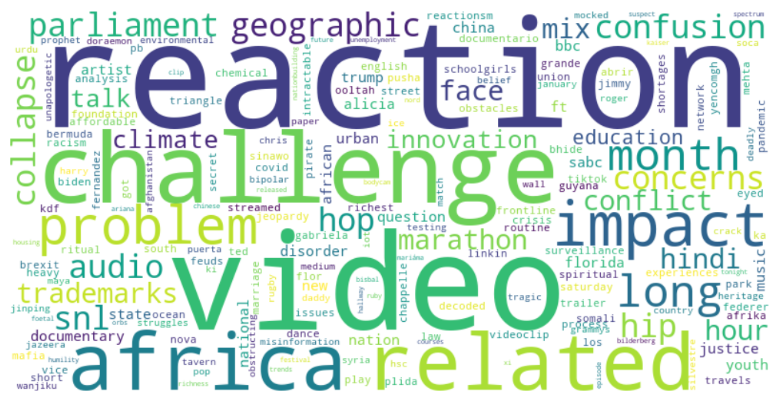
### 4. **Topic Visualization: Histograms**  
A **Histogram** is created to visualize the frequency of topics across the dataset. This provides an overview of how topics are distributed and which topics are most prevalent.

```python
import plotly.express as px

# Create a histogram to visualize the distribution of topics
fig = px.histogram(trained_df, x='llama2_labelone', title='Topic Distribution')
fig.show()
```
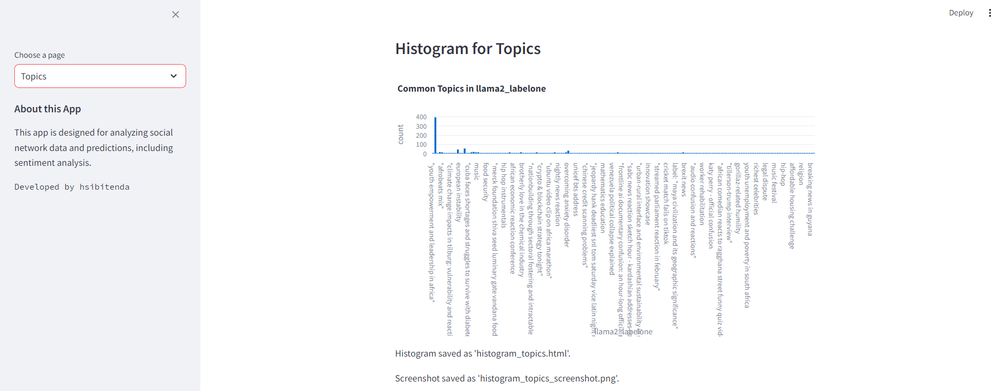
### 5. **Topic Filtering and Count Ranges**  
You can filter topics based on a specific count range. This allows you to focus on topics that appear with a certain frequency, which is helpful for further analysis.

```python
import seaborn as sns

# Slider to select the range for topic counts
min_count, max_count = st.slider("Select range for topic counts", min_value=1, max_value=100, value=(20, 50))

# Filter topics based on the count range
filtered_topics = trained_df['llama2_labelone'].value_counts()
filtered_topics = filtered_topics[(filtered_topics >= min_count) & (filtered_topics <= max_count)].head(100)

# Plot a bar plot for the filtered topics
fig, ax = plt.subplots()
sns.barplot(x=filtered_topics.values, y=filtered_topics.index, palette="viridis", ax=ax)
ax.set_title(f"Topics with Counts Between {min_count} and {max_count}")
ax.set_xlabel("Count")
ax.set_ylabel("Topic")
plt.show()
```
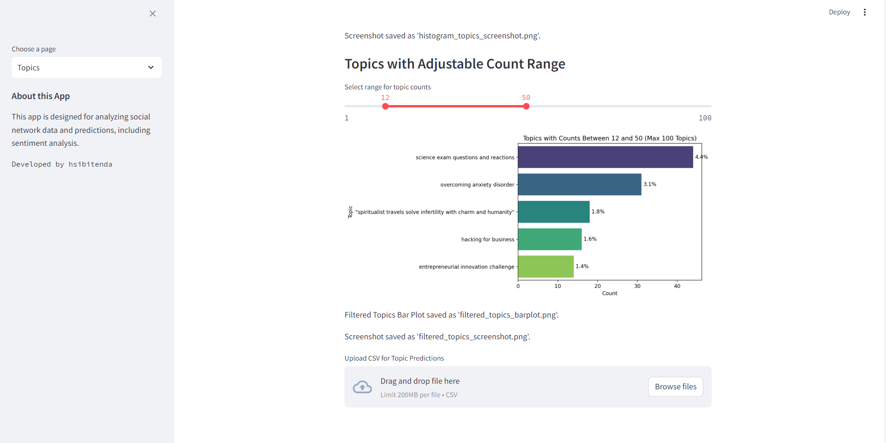
### 6. **Text Cleaning for Topic Extraction**  
To ensure accurate topic extraction, irrelevant or repetitive phrases are removed from the text. This step improves the quality of the extracted topics.

```python
import re

# Function to clean topic text
def extract_topic(text):
    if text is None:
        return None
    exclusion_phrases = [
        "As a responsible", "It is important", "Therefore", "Remember", "I hope you understand", 
        "I cannot provide a", "Please provide me with more", "If you have any other", "Instead", "It's important to"
    ]
    if any(phrase in text for phrase in exclusion_phrases):
        return None
    if text.startswith(('Sure!', 'Based on the keywords provided', 'Certainly! Based on the keywords provided')):
        # Regular expression to extract text within quotes
        topic_match = re.search(r'"(.*?)"', text)
        if topic_match:
            return topic_match.group(1)
        else:
            return text
    else:
        return text
```

### 7. **File Upload for Topic Predictions**  
Users can upload CSV files to make predictions on topics using the pre-trained models. The uploaded text is processed and the predicted topics are displayed in the app.

```python
# File uploader for topic prediction
uploaded_file = st.file_uploader("Upload CSV for Topic Predictions", type="csv")

if uploaded_file is not None:
    test_df = pd.read_csv(uploaded_file)
    test_df = test_df.astype(str)

    # Prepare documents for topic prediction
    documents = [' '.join(doc.split()[:200]) for doc in test_df['Text_lemma'].values]
    embeddings = embedding_model.encode(documents, convert_to_tensor=True).cpu().numpy()

    # Predict topics
    X_embedded = umap.UMAP(n_neighbors=15, n_components=5).fit_transform(embeddings)
    X_new = preprocessing.scale(X_embedded)

    # Make predictions
    predictions_topics = model.predict(X_new)
    test_df['Predicted_Topics'] = predictions_topics
    st.write(test_df[['Text_lemma', 'Predicted_Topics']])

    # Download the predictions as CSV
    csv = test_df.to_csv(index=False).encode('utf-8')
    st.download_button("Download Predicted Topics as CSV", csv, "predicted_topics.csv", "text/csv")
```
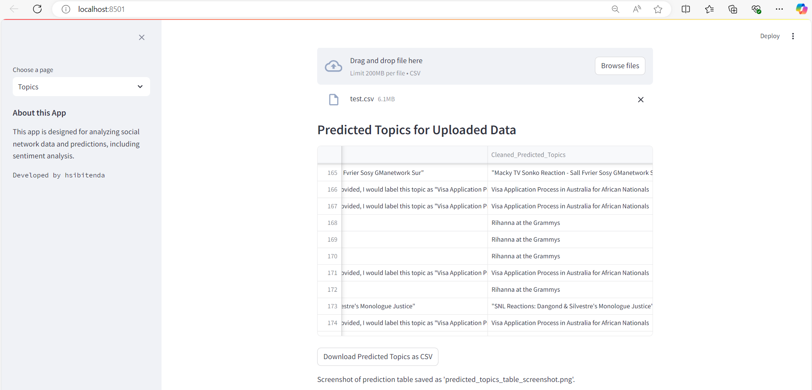
## Theme Extraction:

#### a. **Word Cloud for Themes**:
   - **Code Snippet**: Generates a word cloud from the cleaned themes.

```python
# Word Cloud for Themes
unique_words = set(' '.join(trained_df['cleaned_theme'].astype(str).str.lower().str.strip()).split())
cleaned_text = ' '.join(unique_words)
wordcloud_themes = WordCloud(width=800, height=400, background_color='white').generate(cleaned_text)
fig4, ax4 = plt.subplots()
ax4.imshow(wordcloud_themes, interpolation='bilinear')
ax4.axis('off')
st.pyplot(fig4)

# Save Word Cloud Image and Screenshot
fig4.savefig("wordcloud_themes.png")
st.write("Word Cloud saved as 'wordcloud_themes.png'.")
pyautogui.screenshot("screenshots/wordcloud_themes_screenshot.png")
st.write("Screenshot saved as 'wordcloud_themes_screenshot.png'.")
```
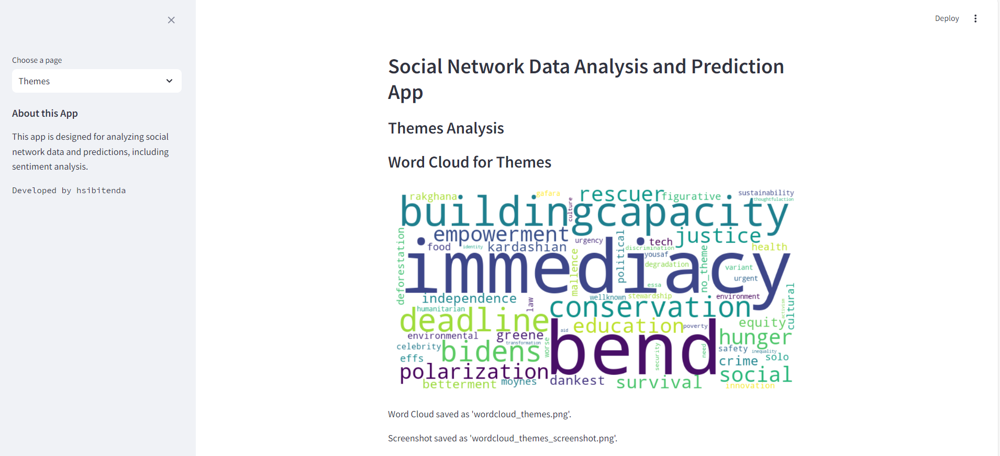
---

#### b. **Histogram for Themes**:
   - **Code Snippet**: Plots a histogram for theme distribution.

```python
# Topic-Based Histogram for Themes
fig5 = px.histogram(trained_df, x='cleaned_theme', title='Common Themes in Social Comments')
st.plotly_chart(fig5)

# Save Plotly Histogram and Screenshot
fig5.write_html("histogram_themes.html")
st.write("Histogram saved as 'histogram_themes.html'.")
pyautogui.screenshot("screenshots/histogram_themes_screenshot.png")
st.write("Screenshot saved as 'histogram_themes_screenshot.png'.")
```

---

#### c. **Themes Based on Count Range**:
   - **Code Snippet**: Filter themes based on count range and display as a bar plot.

```python
# Display Themes Based on Count Range (Topic-Based Themes)
min_count, max_count = st.slider("Select count range", 2, 100, (2, 50))
filtered_themes = trained_df['cleaned_theme'].value_counts()
filtered_themes = filtered_themes[(filtered_themes >= min_count) & (filtered_themes <= max_count)]

if not filtered_themes.empty:
    fig5, ax4 = plt.subplots()
    sns.barplot(x=filtered_themes.values, y=filtered_themes.index, palette="viridis", ax=ax4)
    for j, value in enumerate(filtered_themes.values):
        percentage = f"{(value / len(trained_df)) * 100:.1f}%"
        ax4.text(value + 0.5, j, percentage, ha='left', va='center')
    ax4.set_title(f"Themes with Counts Between {min_count} and {max_count}")
    ax4.set_xlabel("Count")
    ax4.set_ylabel("Theme")
    st.pyplot(fig5)
```
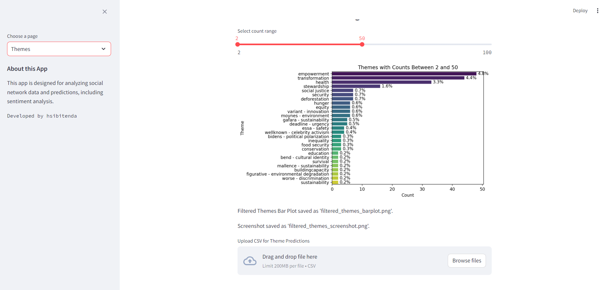
---

#### d. **File Upload for Predictions on Test Dataset**:
   - **Code Snippet**: Handle file upload for theme predictions and display results.

```python
# 2. File Upload for Predictions on Test Dataset
uploaded_file = st.file_uploader("Upload CSV for Theme Predictions", type="csv")
if uploaded_file is not None:
    test_df = pd.read_csv(uploaded_file)
    test_df = test_df.astype(str)

    # Predict themes based on the uploaded data
    documents = [' '.join(doc.split()[:MAX_LEN]) for doc in test_df['Text_lemma'].values]
    embeddings = embedding_model.encode(documents, convert_to_tensor=True).cpu().numpy()
    X_embedded = umap.UMAP(n_neighbors=15, n_components=5, min_dist=0.0, metric='cosine', random_state=42).fit_transform(embeddings)
    x_new = preprocessing.scale(X_embedded)

    # Load model and predict themes
    model_themes = joblib.load('./model/stack_classifier_modelwsp2_theme.pkl')
    predictions_themes = model_themes.predict(x_new)
    test_df['Predicted_Themes'] = predictions_themes

    st.write(test_df[['Text_lemma', 'Predicted_Themes']])
    csv = test_df.to_csv(index=False).encode('utf-8')
    st.download_button("Download Predicted Themes as CSV", csv, "predicted_themes.csv", "text/csv")
```

---

#### e. **Predicted Themes Count Distribution**:
   - **Code Snippet**: Display a bar chart for predicted themes count distribution.

```python
# Display Predicted Themes Count Distribution
pthemes_counts = test_df['Predicted_Themes'].value_counts()
fig4 = px.bar(pthemes_counts, x=pthemes_counts.index, y=pthemes_counts.values, title="Distribution of Predicted Themes")
st.plotly_chart(fig4)

# Save Predicted Themes Bar Plot and Screenshot
fig4.write_html("predicted_themes_barplot.html")
st.write("Predicted Themes Bar Plot saved as 'predicted_themes_barplot.html'.")
pyautogui.screenshot("screenshots/predicted_themes_barplot_screenshot.png")
st.write("Screenshot saved as 'predicted_themes_barplot_screenshot.png'.")
```
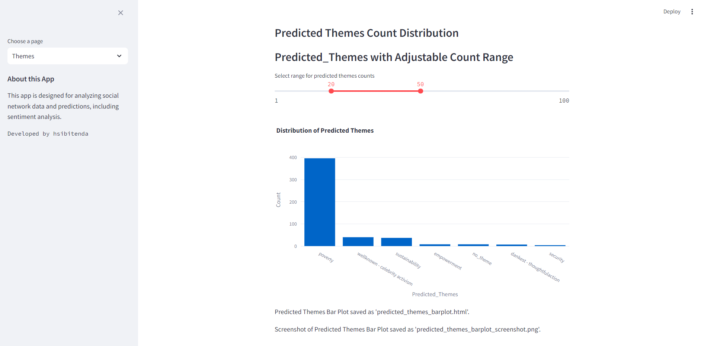
---

## Sentiment Extraction:

#### a. **Sentiment Distribution in Comments**:
   - **Code Snippet**: Plot the sentiment distribution.

```python
# Sentiment Distribution in Comments
sentiment_counts = trained_df['llama3_sentiment'].value_counts()
fig6 = plot_distribution(sentiment_counts, "Sentiment Distribution", "Sentiment", "Count")
st.pyplot(fig6)

# Save Sentiment Distribution Bar Plot and Screenshot
fig6.savefig("sentiment_distribution.png")
st.write("Sentiment Distribution saved as 'sentiment_distribution.png'.")
pyautogui.screenshot("screenshots/sentiment_distribution_screenshot.png")
st.write("Screenshot saved as 'sentiment_distribution_screenshot.png'.")
```
---

#### b. **Top Topics for Each Sentiment**:
   - **Code Snippet**: Display top topics for selected sentiment.

```python
# Top Topics for Each Sentiment
selected_sentiment = st.selectbox("Select a sentiment to view top topics", options=sentiment_counts.index)
sentiment_df = trained_df[trained_df['llama3_sentiment'] == selected_sentiment]
top_topics = sentiment_df['llama2_labelone'].value_counts().head(10)

fig7, ax6 = plt.subplots()
sns.barplot(x=top_topics.values, y=top_topics.index, palette="viridis", ax=ax6)
for j, value in enumerate(top_topics.values):
    percentage = f"{(value / len(sentiment_df)) * 100:.1f}%"
    ax6.text(value + 0.5, j, percentage, ha='left', va='center')
ax6.set_title(f"Top Topics for '{selected_sentiment}' Sentiment")
ax6.set_xlabel("Count")
ax6.set_ylabel("Topics")
st.pyplot(fig7)
```
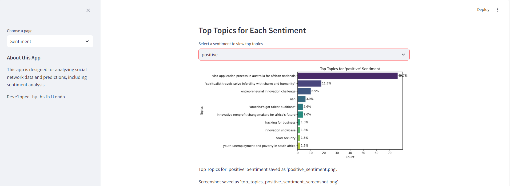


#### c. **Top Themes for Each Sentiment**:
   - **Code Snippet**: Display top themes for selected sentiment.

```python
# Top Themes for Each Sentiment
top_themes = sentiment_df['cleaned_theme'].value_counts().head(10)
fig8, ax7 = plt.subplots()
sns.barplot(x=top_themes.values, y=top_themes.index, palette="viridis", ax=ax7)
for j, value in enumerate(top_themes.values):
    percentage = f"{(value / len(sentiment_df)) * 100:.1f}%"
    ax7.text(value + 0.5, j, percentage, ha='left', va='center')
ax7.set_title(f"Top Themes for '{selected_sentiment}' Sentiment")
ax7.set_xlabel("Count")
ax7.set_ylabel("Theme")
st.pyplot(fig8)
```
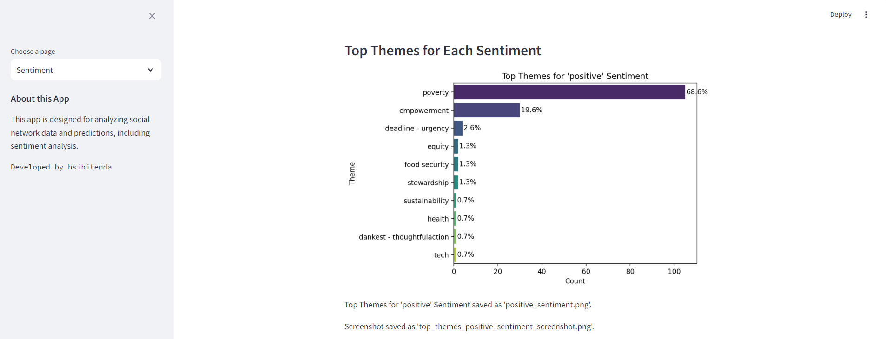

---

#### d. **File Upload for Sentiment Predictions**:
   - **Code Snippet**: Handle file upload for sentiment predictions and display results.

```python
# File Upload for Sentiment Predictions
uploaded_file = st.file_uploader("Upload CSV for Sentiment Predictions", type="csv")
if uploaded_file is not None:
    test_df = pd.read_csv(uploaded_file).astype(str)

    # Sentiment Prediction Model (using BERT)
    model = BertForSequenceClassification.from_pretrained(output_dir)
    tokenizer = BertTokenizer.from_pretrained(output_dir)
    model.to(device)

    # Tokenizing and creating tensors
    new_tokenized_texts = [tokenizer.tokenize(sent) for sent in test_df['Text_lemma']]
    new_input_ids = [tokenizer.convert_tokens_to_ids(x) for x in new_tokenized_texts]
    new_input_ids = [torch.tensor(seq[:MAX_LEN], dtype=torch.long) for seq in new_input_ids]
    new_input_ids_padded = pad_sequence(new_input_ids, batch_first=True, padding_value=0)

    # Predict sentiment
    new_prediction_inputs = new_input_ids_padded
    new_attention_masks = torch.where(new_prediction_inputs != 0, torch.tensor(1), torch.tensor(0))
    model.eval()

    # Make predictions
    new_predictions = []
    for batch in new_prediction_dataloader:
        batch = tuple(t.to(device) for t in batch)
        b_input_ids, b_input_mask = batch
        with torch.no_grad():
            outputs = model(b_input_ids, attention_mask=b_input_mask)
        logits = outputs.logits.detach().cpu().numpy()
        new_predictions.append(logits)

    flat_new_predictions = [item for sublist in new

_predictions for item in sublist]
    flat_new_predictions = [np.argmax(pred) for pred in flat_new_predictions]
    test_df['Predicted_Sentiment'] = flat_new_predictions

    st.write(test_df[['Text_lemma', 'Predicted_Sentiment']])
    csv = test_df.to_csv(index=False).encode('utf-8')
    st.download_button("Download Predicted Sentiments as CSV", csv, "predicted_sentiments.csv", "text/csv")
```
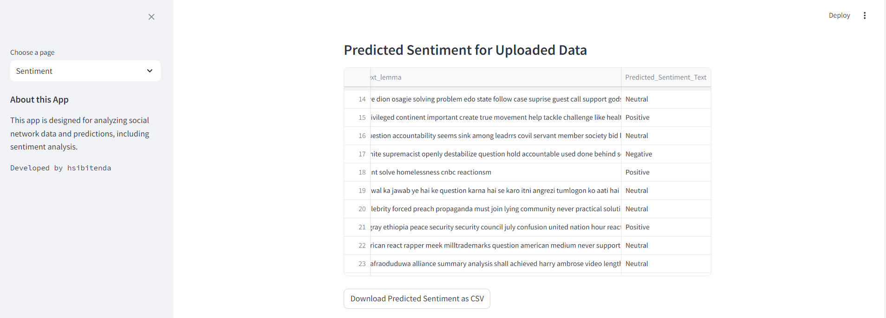
---

#### e. **Predicted Sentiment Count Distribution**:
   - **Code Snippet**: Display predicted sentiment distribution.

```python
# Predicted Sentiment Count Distribution
predicted_sentiment_counts = test_df['Predicted_Sentiment'].value_counts()
fig9 = px.bar(predicted_sentiment_counts, x=predicted_sentiment_counts.index, y=predicted_sentiment_counts.values, title="Distribution of Predicted Sentiments")
st.plotly_chart(fig9)

# Save Predicted Sentiment Distribution Bar Plot and Screenshot
fig9.write_html("predicted_sentiment_distribution.html")
st.write("Predicted Sentiment Distribution saved as 'predicted_sentiment_distribution.html'.")
pyautogui.screenshot("screenshots/predicted_sentiment_distribution_screenshot.png")
st.write("Screenshot saved as 'predicted_sentiment_distribution_screenshot.png'.")
```

## Temporal Analysis of Themes and Topics Over Time

### Overview:
The **Temporal Analysis** section provides insights into how the themes and topics in the dataset evolve over time. It allows users to explore trends, patterns, and changes in themes or topics based on various time granularities, such as daily, weekly, monthly, or yearly. This analysis also incorporates sentiment information and forecasting for future trends using Prophet.

---

### 1. **Date Preprocessing**:
- **Data Cleaning**: The code begins by checking whether the dataset contains a `Date` column. It ensures that the `Date` column is correctly parsed into datetime format and any invalid or missing date values are dropped to avoid errors during analysis.
```python
trained_df['Date'] = pd.to_datetime(trained_df['Date'], errors='coerce')
trained_df = trained_df.dropna(subset=['Date'])  # Remove rows with invalid dates
```

---

### 2. **Category and Sentiment Selection**:
- **Category for Temporal Analysis**: The user can select whether to analyze **Topics** or **Themes**. The choice of category determines which column of the dataset (either `llama2_labelone` for Topics or `cleaned_theme` for Themes) is used for further analysis.
```python
temporal_category = st.selectbox("Select category for temporal analysis", ["Topics", "Themes"])
category_column = 'llama2_labelone' if temporal_category == "Topics" else 'cleaned_theme'
```

- **Time Granularity**: The user can select the level of time granularity—**Daily**, **Weekly**, **Monthly**, or **Yearly**—which determines how the data is grouped by date.
```python
time_granularity = st.selectbox("Select time granularity", ["Daily", "Weekly", "Monthly", "Yearly"])
date_freq = {'Daily': 'D', 'Weekly': 'W', 'Monthly': 'M', 'Yearly': 'Y'}[time_granularity]
```

- **Sentiment Selection**: Users can filter data by sentiment. The options are:
  - **All Sentiments**: Analyzes all sentiment types.
  - **Positive, Negative, Neutral**: Focuses only on the selected sentiment category.
```python
sentiment_category = st.selectbox("Select sentiment for observation", ["All Sentiments", "Positive", "Negative", "Neutral"])
```
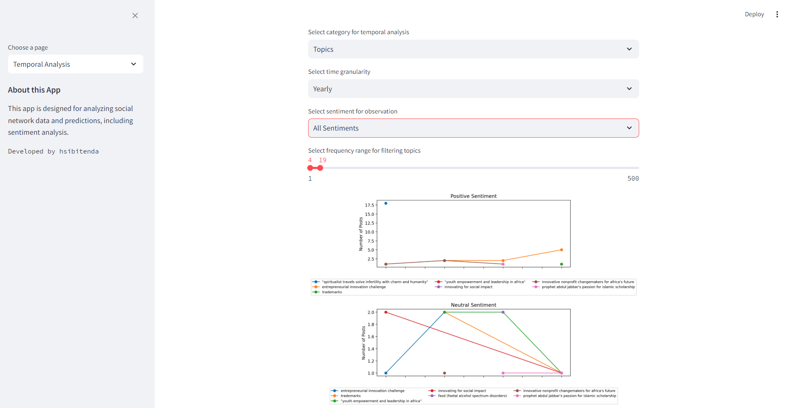
---

### 3. **Frequency Filtering**:
- **Frequency Range Selection**: Users can select a frequency range for filtering themes or topics. This allows them to focus on the most commonly occurring themes or topics over time.
```python
category_counts = trained_df[category_column].value_counts()
min_count, max_count = category_counts.min(), category_counts.max()

min_freq, max_freq = st.slider(
    f"Select frequency range for filtering {temporal_category.lower()}",
    min_value=int(min_count),
    max_value=int(max_count),
    value=(100, 500)  # Default range
)
```
- **Filtered Dataset**: After filtering by frequency and sentiment, the dataset is updated accordingly for further analysis.
```python
filtered_categories = category_counts[(category_counts >= min_freq) & (category_counts <= max_freq)].index
filtered_df = trained_df[trained_df[category_column].isin(filtered_categories)]

if sentiment_category != "All Sentiments":
    filtered_df = filtered_df[filtered_df['llama3_sentiment'] == sentiment_category]
```

---

### 4. **Grouping Data by Date and Sentiment**:
- **Group Data**: The dataset is grouped by the selected time granularity (`date_freq`), sentiment, and categories (topics or themes). The number of posts for each category within each time period is counted.
```python
aggr_df = filtered_df.groupby([category_column, pd.Grouper(key='Date', freq=date_freq), 'llama3_sentiment'])['Text_lemma'].count().reset_index()
aggr_df.columns = [category_column, 'Date', 'llama3_sentiment', 'Posts']
```

---

### 5. **Visualization of Trends**:
- **Sentiment-Based Subplots**: The data is visualized using line plots, one for each sentiment (Positive, Negative, Neutral). Each line represents a different theme or topic over time, showing the number of posts.
```python
fig, axes = plt.subplots(nrows=len(unique_sentiments), ncols=1, figsize=(10, len(unique_sentiments) * 4), sharex=True)

for i, sentiment in enumerate(unique_sentiments):
    ax = axes[i]
    sentiment_data = aggr_df[aggr_df['llama3_sentiment'] == sentiment]
    for category in filtered_categories:
        category_data = sentiment_data[sentiment_data[category_column] == category]
        if not category_data.empty:
            ax.plot(category_data['Date'], category_data['Posts'], label=category, marker='o')
    ax.set_title(f'{sentiment.capitalize()} Sentiment')
    ax.set_ylabel('Number of Posts')
    ax.legend(loc="upper center", bbox_to_anchor=(0.5, -0.15), fontsize='small', ncol=3)
```

- **Plot Adjustment**: To ensure a clean layout, the legend is positioned outside the main plot area, and the x-axis is adjusted to include the date labels.
```python
fig.text(0.5, 0.04, 'Date', ha='center', fontsize=12)
plt.tight_layout(rect=[0, 0.05, 1, 0.95])
st.pyplot(fig)
```


---

### 6. **Forecasting with Prophet**:
- **Forecast for Selected Categories**: Using the **Prophet** forecasting model, predictions are made for the next 360 days (one year) based on the historical trend of the selected categories. The forecast includes predictions for the number of posts and confidence intervals.
```python
if st.button("Forecast for Selected Categories"):
    forecast_data = []

    for category in filtered_categories:
        category_df = aggr_df[aggr_df[category_column] == category][['Date', 'Posts']].copy()
        category_df.columns = ['ds', 'y']  # Prophet requires specific column names

        # Remove timezone information if present
        category_df['ds'] = category_df['ds'].dt.tz_localize(None)

        # Initialize and fit the Prophet model
        model = Prophet(yearly_seasonality=True, daily_seasonality=False)
        model.fit(category_df)

        # Make predictions for the next 360 days
        future = model.make_future_dataframe(periods=360)
        forecast = model.predict(future)

        # Store the forecast for each category
        forecast['Category'] = category
        forecast_data.append(forecast)

    all_forecasts = pd.concat(forecast_data)
    all_forecasts['ds'] = all_forecasts['ds'].dt.tz_localize(None)
```

- **Forecast Visualization**: The forecasts are plotted alongside the historical data for each sentiment. The forecasted values are shown with confidence intervals, and a separate plot is generated for each sentiment type.
```python
fig_forecast, axes_forecast = plt.subplots(nrows=len(unique_sentiments), ncols=1, figsize=(10, len(unique_sentiments) * 4), sharex=True)

for i, sentiment in enumerate(unique_sentiments):
    sentiment_forecast = all_forecasts[all_forecasts['Category'].isin(filtered_categories)]
    sentiment_data = filtered_df[filtered_df['llama3_sentiment'] == sentiment]
    sentiment_category_counts = sentiment_data.groupby([pd.Grouper(key='Date'), category_column]).size().reset_index(name='Posts')

    for category in filtered_categories:
        category_hist_data = sentiment_category_counts[sentiment_category_counts[category_column] == category]
        if not category_hist_data.empty:
            axes_forecast[i].plot(category_hist_data['Date'], category_hist_data['Posts'], label=f'{category} Historical', linestyle='-', marker='o')

        category_forecast = sentiment_forecast[sentiment_forecast['Category'] == category]
        if not category_forecast.empty:
            axes_forecast[i].plot(category_forecast['ds'], category_forecast['yhat'], label=f'{category} Forecast', linestyle='--')
            axes_forecast[i].fill_between(category_forecast['ds'], category_forecast['yhat_lower'], category_forecast['yhat_upper'], alpha=0.2)

    axes_forecast[i].set_title(f'Forecasts for {sentiment.capitalize()} Sentiment')
    axes_forecast[i].set_ylabel('Forecasted Posts')
    axes_forecast[i].legend(loc="upper center", bbox_to_anchor=(0.5, -0.15), fontsize='small', ncol=3)
```

- **Saving and Downloading**: After the forecast plots are generated, they are saved as images, and screenshots of the plots are captured for reporting or further analysis.
```python
fig_forecast.savefig("forecast_sentiment_analysis.png")
st.write("Forecast Sentiment Analysis plot saved as 'forecast_sentiment_analysis.png'.")
pyautogui.screenshot("screenshots/forecast_sentiment_analysis_screenshot.png")
st.write("Screenshot saved as 'forecast_sentiment_analysis_screenshot.png'.")
```

## Social Network Analysis (SNA)

### Overview:
The **Social Network Analysis** section is designed to help explore the relationships and interactions between various entities (persons, organizations, or locations) in a dataset. It uses graph-based methods to understand the structure of connections between these entities and leverages **Node Embeddings** via a **Graph Convolutional Network (GCN)** for better visualization. Additionally, it includes methods for community detection, influence, and link analysis, offering insights into the dynamics of relationships in the dataset.

---

### 1. **User Interaction for Selecting Entity Category**:
- Users are prompted to select an **Entity Category** for analysis. The available options are:
  - **Persons**
  - **Organizations**
  - **Locations**

- The selected category determines how the data is filtered by the `Entity_Categories` column in the dataset.
```python
entity_categories = ['persons', 'organization', 'location']
selected_category = st.selectbox("Select Entity Category", entity_categories)

filter_mask = trained_df['Entity_Categories'].apply(lambda x: selected_category in x)
filtered_df = trained_df[filter_mask]
```

- **Filtered Data Preview**: After filtering the dataset based on the selected category, a preview of the data is shown for review.
```python
st.write("### Filtered Data Preview")
st.dataframe(filtered_df)
```
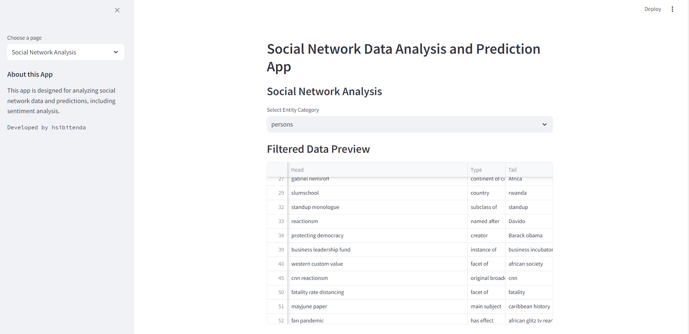
---

### 2. **Graph Construction for Social Network**:
- **Node Creation**: Nodes are added to the graph for each **Topic**, **Sentiment**, and **Theme** found in the filtered data. These nodes represent entities involved in the discussions.
```python
G = nx.Graph()

for index, row in filtered_df.iterrows():
    topic = row['llama2_labelone']
    sentiment = row['llama3_sentiment']
    theme = row['cleaned_theme']

    # Add nodes for Topic, Sentiment, and Theme
    G.add_node(topic, type='Topic')
    G.add_node(sentiment, type='Sentiment')
    G.add_node(theme, type='Theme')

    # Create edges between Topic, Sentiment, and Theme
    G.add_edge(topic, sentiment)
    G.add_edge(topic, theme)
    G.add_edge(sentiment, theme)
```

- **Edge Mapping**: The graph is transformed into a form suitable for PyTorch (edge indices), and a **feature matrix** is initialized using the identity matrix (representing initial features of nodes).
```python
node_mapping = {node: idx for idx, node in enumerate(G.nodes())}

edges = [(node_mapping[node1], node_mapping[node2]) for node1, node2 in G.edges]
edge_index = torch.tensor(edges, dtype=torch.long).t().contiguous()

num_nodes = len(G.nodes)
x = torch.eye(num_nodes, dtype=torch.float)  # Identity matrix for features
data = Data(x=x, edge_index=edge_index)
```

---

### 3. **Graph Convolutional Network (GCN) for Node Embeddings**:
- A **Graph Convolutional Network (GCN)** is used to learn **node embeddings**, which represent the relationships between different nodes (Topic, Sentiment, Theme) in a lower-dimensional space.
  
- **GCN Model**: A simple two-layer GCN model is used for this purpose. The model is trained using **PyTorch Geometric** and optimizes to learn meaningful node representations.
```python
class GCN(nn.Module):
    def __init__(self, in_channels, out_channels):
        super(GCN, self).__init__()
        self.conv1 = GCNConv(in_channels, 16)
        self.conv2 = GCNConv(16, out_channels)

    def forward(self, data):
        x, edge_index = data.x, data.edge_index
        x = self.conv1(x, edge_index)
        x = torch.relu(x)
        x = self.conv2(x, edge_index)
        return x

model = GCN(in_channels=num_nodes, out_channels=2)
optimizer = torch.optim.Adam(model.parameters(), lr=0.01)

# Training the model
model.train()
for epoch in range(200):
    optimizer.zero_grad()
    out = model(data)
    loss = out.norm()  # A dummy loss function (could be adjusted)
    loss.backward()
    optimizer.step()
```

- **PCA for Dimensionality Reduction**: After training, **Principal Component Analysis (PCA)** is used to reduce the learned embeddings to 2D space for visualization.
```python
model.eval()
with torch.no_grad():
    embeddings = model(data)

pca = PCA(n_components=2)
embeddings_2d = pca.fit_transform(embeddings.numpy())
```

---

### 4. **User Interaction for Network Structure Analysis**:
- The user can choose the type of network structure to analyze, which includes options like **Community**, **Influence**, and **Link**.

- **Community Structure**: The user can choose different attributes (e.g., **Modularity**, **Degree**, **Clustering Coefficient**) to detect communities in the network. The **Louvain method** is used for community detection.
```python
if structure_type == "Community":
    selected_community_attribute = st.selectbox("Select Community Attribute", community_attributes)
    partition = community_louvain.best_partition(G)
    # Assign weights based on the selected community attribute
    ...
```
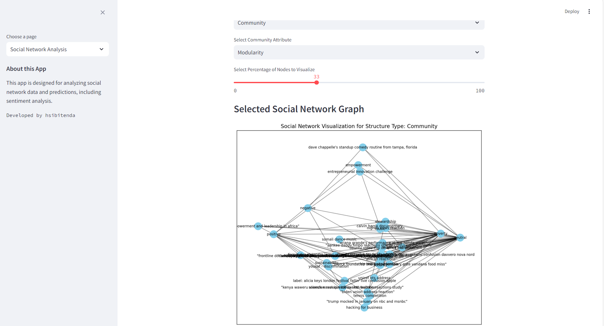
- **Influence Structure**: The user can choose from various influence attributes like **Closeness Centrality**, **Betweenness Centrality**, and **Eigenvector Centrality**. These centrality measures help to understand the importance of each node in the network.
```python
if structure_type == "Influence":
    selected_influence_attribute = st.selectbox("Select Influence Attribute", influence_attributes)
    # Assign centrality-based weights
    ...
```
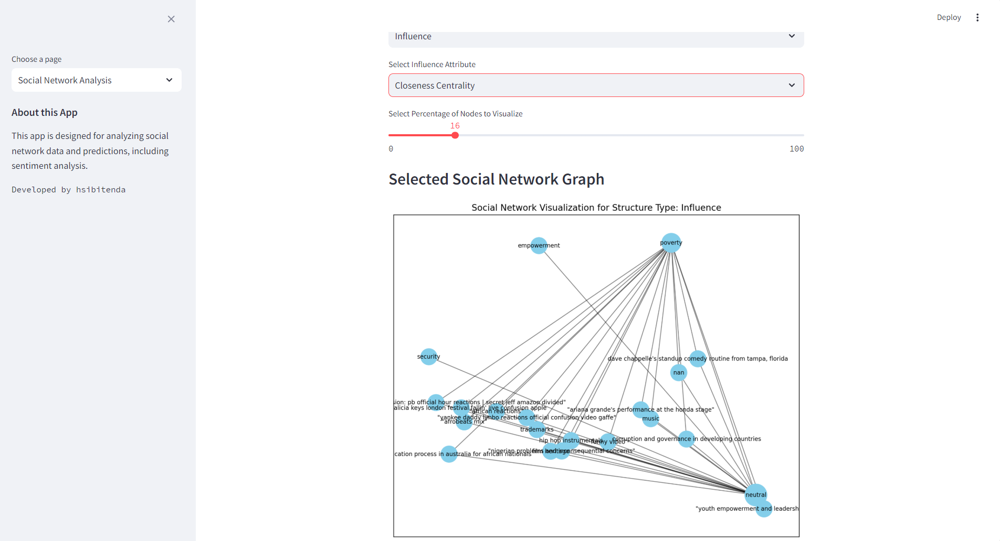
- **Link Structure**: The user can explore **Density** or **PageRank** for link-based analysis.
```python
if structure_type == "Link":
    selected_link_attribute = st.selectbox("Select Link Attribute", link_attributes)
    # Assign link-based weights
    ...
```
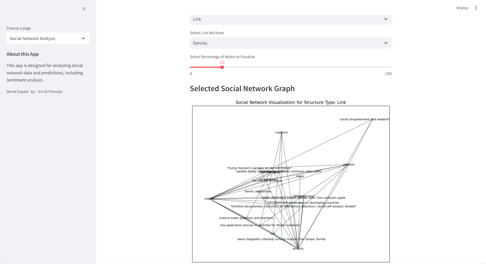
---

### 5. **Node Visualization and Network Filtering**:
- After defining the structure and attributes, users can choose the percentage of **top nodes** to visualize, based on their **weight** (importance).
  
- The **selected nodes** are then visualized in the network graph, using the **PCA-based 2D positions** for the nodes. The **Spring Layout** is applied to optimize node placement and reduce overlaps.
```python
percentage = st.slider("Select Percentage of Nodes to Visualize", 0, 100, 100)
num_nodes_to_visualize = max(1, int(len(G_selected.nodes()) * (percentage / 100)))
selected_nodes = sorted(G_selected.nodes(), key=lambda n: G_selected.nodes[n]['weight'], reverse=True)[:num_nodes_to_visualize]
G_filtered = G_selected.subgraph(selected_nodes)

pos = {node: (embeddings_2d[node_mapping[node], 0], embeddings_2d[node_mapping[node], 1]) for node in G_filtered.nodes()}
pos = nx.spring_layout(G_filtered, pos=pos, seed=42, k=0.15, iterations=300)  # Layout refinement
```

- **Graph Visualization**: The network is visualized using **NetworkX**'s graph drawing functions, where node sizes and labels are adjusted according to their **weights** (e.g., centrality, degree).
```python
node_sizes = [1000 * G_filtered.nodes[node]['weight'] for node in G_filtered.nodes()]
node_labels = {node: f"{node}" for node in G_filtered.nodes()}

nx.draw_networkx_nodes(G_filtered, pos, node_size=node_sizes, node_color='skyblue')
nx.draw_networkx_edges(G_filtered, pos, alpha=0.5)
nx.draw_networkx_labels(G_filtered, pos, labels=node_labels, font_size=8)
```

---

### 6. **Screenshots and Output**:
- The visualized graph is displayed using **Streamlit** and saved as a screenshot for reporting.
```python
st.pyplot(plt)
pyautogui.screenshot("screenshots/social_actors_screenshot.png")
st.write("Screenshot of Social_actors_screenshot.png'.")
```

---

